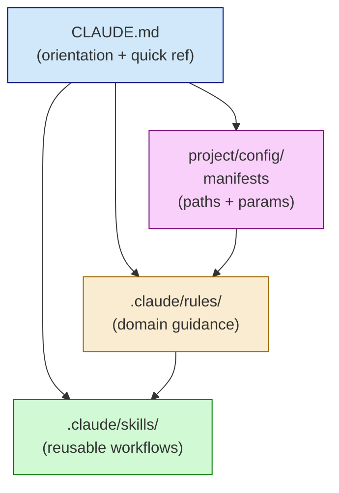

# CLAUDE.md Structure

The `CLAUDE.md` file at your project root provides project-level instructions that Claude Code reads at the start of each session.

## Design Philosophy

**Keep it concise**. CLAUDE.md is for orientation, not exhaustive documentation. Use:
- Rules (`.claude/rules/`) for domain-specific guidance
- Skills (`.claude/skills/`) for reusable workflows
- Manifests (`project/config/`) for paths and parameters



## Recommended Structure

```markdown
# CLAUDE.md

## Project Overview

Brief description (1-2 sentences). What is this project?
What data does it work with?

## Current Phase

Quick status table showing where work is focused:

| Phase | Location | Status |
|-------|----------|--------|
| Preprocessing | `project/01_Preprocessing/` | Complete |
| Analysis | `project/02_Analyses/` | Active |

## Orientation: Understanding Current State

**To understand what's being worked on:**
1. Check experiment catalog
2. Look at experiments with status: development
3. Each experiment has metadata describing its purpose

**To understand available data:**
1. raw_data_manifest.yaml - source of truth
2. reference_datasets.yaml - external resources
3. analysis_outputs.yaml - contributions from completed experiments

**To understand project decisions:**
1. Point to decision documentation
2. Experiment README files for rationale

## Behavioral Rules

Reference rules in `.claude/rules/`:
- rule_name.md - brief description of when it applies

## Quick Reference

### Manifests Table

| Manifest | Purpose |
|----------|---------|
| raw_data_manifest.yaml | Source of truth for all data paths |
| reference_datasets.yaml | External atlases, models, references |
| container_registry.yaml | HPC containers and environments |

### Key Data Summary

- Dataset size and key statistics
- Primary data objects and their locations
- Important preprocessing outputs

### Common Workflows

```r
# Start new experiment
source("scripts/init_experiment.R")
init_experiment("name", "ResearchArea")

# Complete experiment
source("scripts/complete_experiment.R")
complete_experiment("name_YYYYMMDD")
```

## HPC Environment

Quick reference for HPC specifics:
- Cluster name, account, partition
- Container paths (just reference, details in registry)
- Bind mount overview

## External References

Links to external resources:
- Reference codebases
- Published datasets
- Documentation URLs

## Scientific Context

Brief description of:
- Research goals
- Key biological concepts
- Domain vocabulary

## Skills

List available custom skills:
- `skill-name` - what it does
```

## Key Principles

### 1. Manifest References Over Path Lists

Don't list every path. Reference manifests:

```markdown
### Data Locations

See `project/config/raw_data_manifest.yaml` for all data paths.
```

### 2. Phase-Appropriate Content

Update CLAUDE.md as project progresses:
- Move completed phases to reference status
- Highlight active work areas
- Update status tables

### 3. Rule Delegation

Detailed guidance goes in rules:

```markdown
## Behavioral Rules

Rules in `.claude/rules/` provide context-specific guidance:
- `analyses/experiment-lifecycle.md` - how to work with experiments
- `hpc-execution.md` - SLURM and container gotchas
```

### 4. Quick Reference Over Full Documentation

CLAUDE.md is for orientation. Include:
- One-liner descriptions
- Quick lookup tables
- Links to detailed docs

Not:
- Exhaustive parameter lists
- Complete API documentation
- Tutorial content

### Information Density Pyramid

```
              ┌─────────────────┐
              │   Orientation    │  CLAUDE.md: "what is this project?"
              │  (broadest view) │  Phase status, research goals
            ┌─┴─────────────────┴─┐
            │  Domain Specifics    │  Rules: HPC gotchas, lifecycle,
            │ (contextual detail)  │  SLURM practices, deprecation
          ┌─┴─────────────────────┴─┐
          │   Implementation Detail  │  Skills: step-by-step workflows
          │   (deepest guidance)     │  Manifests: exact paths/params
          └─────────────────────────┘
```

## Example: Research Area Definitions

Define vocabulary that Claude should use consistently:

```markdown
### Research Areas

Valid research areas: `Integration`, `CellAnnotation`,
`DifferentialAbundance`, `SpatialAnalysis`, `QualityControl`

These are used for experiment categorization and directory organization.
```

## Maintenance

Update CLAUDE.md when:
- Project phase changes (preprocessing → analysis)
- New manifests are added
- Key workflows change
- New skills become available

Don't update for:
- Individual experiment changes (catalog tracks these)
- Parameter tweaks (manifests handle these)
- Bug fixes (commit messages document these)
