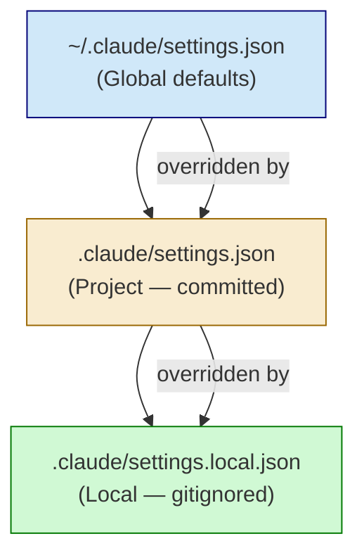
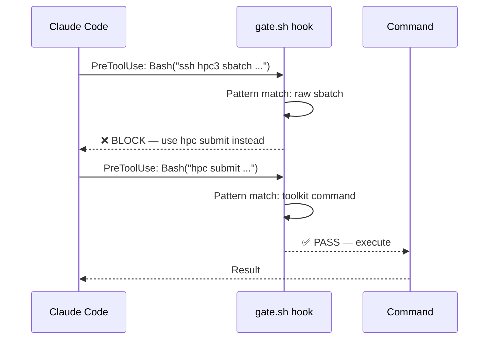

# Claude Code Settings and Hooks

Configure Claude Code's behavior with settings files and session hooks.

## File Locations

| File | Scope | Purpose |
|------|-------|---------|
| `.claude/settings.json` | Project (committed) | Shared project settings |
| `.claude/settings.local.json` | Local (gitignored) | User-specific settings |
| `~/.claude/settings.json` | Global | User defaults |



## Settings Structure

### Basic Template (`.claude/settings.json`)

```json
{
  "permissions": {
    "allow": []
  }
}
```

This minimal version commits no permissions, leaving them for local configuration.

### Full Local Settings (`.claude/settings.local.json`)

```json
{
  "permissions": {
    "allow": [
      "Bash(ls:*)",
      "Bash(mkdir:*)",
      "Bash(cp:*)",
      "Bash(mv:*)",
      "Bash(chmod:*)",
      "Bash(find:*)",
      "Bash(grep:*)",
      "Bash(python3:*)",
      "Bash(Rscript:*)",
      "Bash(git:*)",
      "WebSearch",
      "WebFetch(domain:github.com)",
      "WebFetch(domain:docs.example.com)",
      "Skill(project-status)",
      "Skill(project-discovery)"
    ],
    "deny": [],
    "additionalDirectories": [
      "/path/to/reference/codebase/",
      "/path/to/shared/templates/"
    ]
  },
  "hooks": {
    "SessionStart": [
      {
        "hooks": [
          {
            "type": "command",
            "command": "cat .claude/trace-framework.md"
          }
        ]
      }
    ]
  },
  "enabledPlugins": {
    "r-lsp": true,
    "pyright-lsp@claude-plugins-official": true
  }
}
```

## Permission Patterns

### Permission Types

| Type | Behavior |
|------|----------|
| `allow` | Auto-approve, no prompt |
| `ask` | Yes/No prompt every time (no "always allow" option) |
| `deny` | Block entirely |

```json
{
  "permissions": {
    "allow": ["Bash(ls:*)"],     // Auto-approved
    "ask": ["Bash(rm -rf:*)"],   // Always prompts yes/no
    "deny": ["Bash(shutdown:*)"] // Blocked
  }
}
```

**Use `ask` for destructive operations** you want to review but not block entirely.

### Command Permissions

```json
"Bash(command:*)"           // Allow command with any args
"Bash(git check-ignore:*)"  // Specific subcommand
```

### Domain-Specific Web Access

```json
"WebFetch(domain:docs.scvi-tools.org)",
"WebFetch(domain:satijalab.github.io)",
"WebFetch(domain:www.nature.com)"
```

### Skill Permissions

```json
"Skill(project-status)",
"Skill(marker-debate)"
```

## Additional Directories

Grant Claude access to directories outside the project:

```json
"additionalDirectories": [
  "/path/to/reference/analysis/code/",
  "/path/to/shared/templates/"
]
```

Use cases:
- Reference codebases for patterns
- Shared lab templates
- External data directories

## Session Hooks



### SessionStart Hook

Execute commands when a session begins:

```json
"hooks": {
  "SessionStart": [
    {
      "hooks": [
        {
          "type": "command",
          "command": "cat .claude/trace-framework.md"
        }
      ]
    }
  ]
}
```

This injects the trace-framework content at session start, ensuring objectivity rules are loaded before any interaction.

### Hook Types

| Type | Description |
|------|-------------|
| `command` | Run shell command, output injected into context |

## Language Server Plugins

Enable language-specific intelligence:

```json
"enabledPlugins": {
  "r-lsp": true,
  "pyright-lsp@claude-plugins-official": true,
  "typescript-lsp@claude-plugins-official": true
}
```

## Best Practices

### 1. Separate Project vs Local Settings

**Project settings** (committed):
- Minimal permissions
- Project-wide configurations
- Plugin enablement

**Local settings** (gitignored):
- User-specific permissions
- Additional directories
- Session hooks

### 2. Progressive Permission Granting

Start restrictive, add permissions as needed:

```json
// Start with nothing
"allow": []

// Add as you use them
"allow": [
  "Bash(ls:*)",  // Added when needed listing
  "Bash(git:*)" // Added when needed git operations
]
```

### 3. Domain-Specific Web Access

Grant only documentation sites you actually use:

```json
// Good: Specific domains
"WebFetch(domain:docs.scvi-tools.org)"

// Avoid: Overly broad
"WebFetch(*)"
```

### 4. Reference Directories

Include mature codebases as references:

```json
"additionalDirectories": [
  "../reference_project/"  // Working patterns to copy
]
```

## Common Permission Patterns

### Scientific Computing

```json
"allow": [
  "Bash(python3:*)",
  "Bash(Rscript:*)",
  "Bash(R --slave -e:*)",
  "Bash(conda:*)",
  "Bash(mamba:*)"
]
```

### HPC Operations (with Toolkit)

Split read-only commands (auto-allow) from destructive operations (always prompt):

```json
"allow": [
  "Bash(~/.claude/hpc-toolkit/bin/hpc status*)",
  "Bash(~/.claude/hpc-toolkit/bin/hpc logs*)",
  "Bash(~/.claude/hpc-toolkit/bin/hpc file ls*)",
  "Bash(~/.claude/hpc-toolkit/bin/hpc file cat*)",
  "Bash(~/.claude/hpc-toolkit/bin/hpc git status*)",
  "Bash(~/.claude/hpc-toolkit/bin/hpc git log*)",
  "Bash(~/.claude/hpc-toolkit/bin/hpc git diff*)",
  "Bash(~/.claude/hpc-toolkit/bin/hpc workspace list*)",
  "Bash(~/.claude/hpc-toolkit/bin/hpc --help*)"
],
"ask": [
  "Bash(~/.claude/hpc-toolkit/bin/hpc submit*)",
  "Bash(~/.claude/hpc-toolkit/bin/hpc cancel*)",
  "Bash(~/.claude/hpc-toolkit/bin/hpc git push*)",
  "Bash(~/.claude/hpc-toolkit/bin/hpc git commit*)",
  "Bash(~/.claude/hpc-toolkit/bin/hpc file rm*)",
  "Bash(~/.claude/hpc-toolkit/bin/hpc file mv*)",
  "Bash(~/.claude/hpc-toolkit/bin/hpc workspace sync*)"
]
```

This pattern ensures destructive HPC operations always prompt yes/no without the option to auto-approve permanently.

### Git Operations

```json
"allow": [
  "Bash(git status:*)",
  "Bash(git diff:*)",
  "Bash(git log:*)",
  "Bash(git check-ignore:*)"
]
```

### File Operations

```json
"allow": [
  "Bash(ls:*)",
  "Bash(mkdir:*)",
  "Bash(cp:*)",
  "Bash(mv:*)",
  "Bash(chmod:*)",
  "Bash(touch:*)",
  "Bash(wc:*)",
  "Bash(unzip:*)"
]
```

## Troubleshooting

### Permission Denied Errors

If a command is blocked:
1. Check exact command syntax in error
2. Add specific permission pattern
3. Use wildcards cautiously

### Hook Not Executing

Verify:
1. File exists at specified path
2. Command syntax is valid
3. JSON is properly formatted

### Plugin Not Working

Check:
1. Plugin is installed
2. Correct plugin identifier used
3. `enabledPlugins` key spelled correctly
