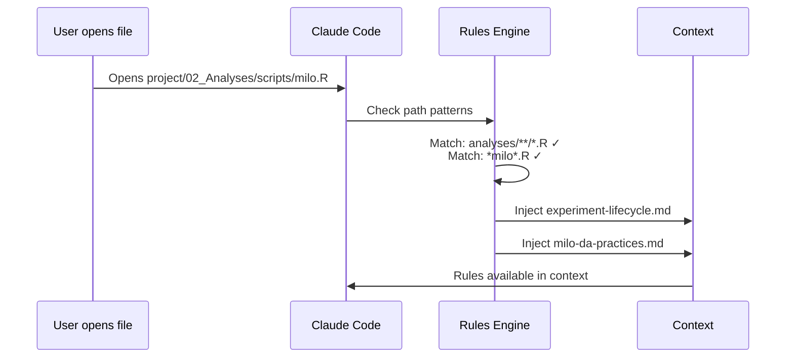
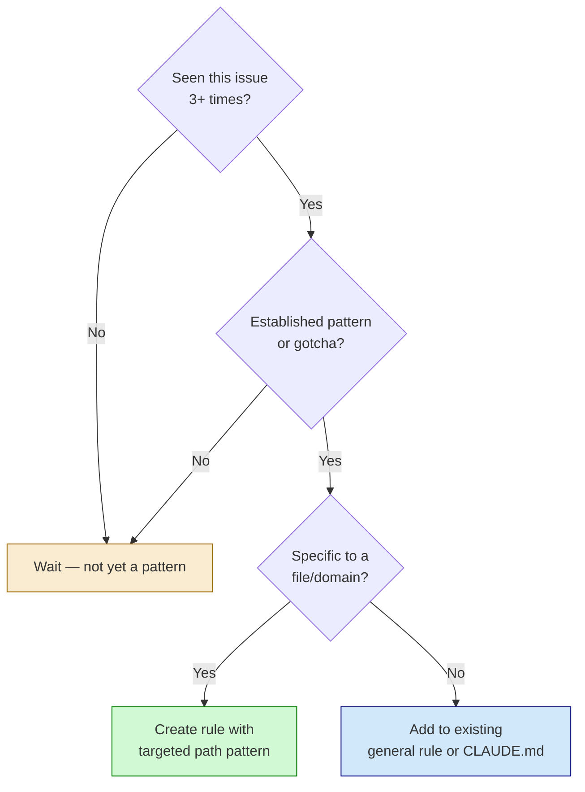

# Contextual Rules Framework

Rules are markdown files that provide domain-specific guidance, activated based on file paths or triggers.

## Directory Structure

```
.claude/rules/
├── hpc-execution.md              # HPC gotchas
├── preprocessing-reference.md    # Preprocessing phase guidance
└── analyses/
    ├── experiment-lifecycle.md   # Working with experiments
    ├── experiment-completion.md  # Completing experiments
    ├── manifest-usage.md         # Loading paths from manifests
    ├── slurm-practices.md        # SLURM job patterns
    ├── deprecation-policy.md     # Handling deprecated code
    └── milo-da-practices.md      # Domain-specific (MiloR)
```

## Rule File Format



### Basic Structure

```markdown
---
paths: project/02_Analyses/**/*
---

# Rule Title

Content that applies when working on files matching the path pattern.
```

### With Multiple Paths

```markdown
---
paths:
  - project/02_Analyses/**/*.py
  - project/02_Analyses/**/*.R
  - project/02_Analyses/**/*.Rmd
---
```

### With Triggers

```markdown
---
paths:
  - "**/.deprecated/**"
triggers:
  - deprecate
  - archive old
---

# Deprecation Policy

Activated when working with .deprecated directories OR when
"deprecate" or "archive old" appears in conversation.
```

## Path Pattern Syntax

| Pattern | Matches |
|---------|---------|
| `project/**/*` | All files under project/ |
| `**/*.R` | All R files anywhere |
| `project/02_Analyses/**/*.py` | Python files in Analyses |
| `**/run/**/*.sh` | Shell scripts in any run/ directory |

## Rule Categories

### 1. Phase-Specific Rules

Guidance that applies to a project phase:

```markdown
---
paths: project/01_Preprocessing/**/*
---

# Preprocessing Phase Reference

This rule documents patterns established during preprocessing.
Use as reference when building on preprocessing outputs.
```

### 2. Workflow Rules

How to perform common operations:

```markdown
---
paths: project/02_Analyses/analyses/**/*
---

# Experiment Lifecycle

## Starting New Work

source("scripts/init_experiment.R")
init_experiment("name", "ResearchArea")
```

### 3. Technical Gotchas

Hard-won debugging lessons:

```markdown
---
paths:
  - project/02_Analyses/**/run/**
  - project/02_Analyses/**/*.sh
---

# SLURM Job Practices

## Container Mount Failures

### `/scratch` does not exist on all nodes

FATAL: container creation failed: mount /scratch...

**Fix**: Remove /scratch from bind mounts.
```

### 4. Domain-Specific Guidance

Patterns for specific tools or methods:

```markdown
---
paths:
  - project/02_Analyses/**/scripts/*milo*.R
  - project/02_Analyses/**/scripts/*da*.Rmd
---

# MiloR DA Toolkit

Reusable utilities for MiloR differential abundance analysis.
```

## Writing Effective Rules

### 1. Be Specific About When It Applies

Good:
```yaml
paths: project/02_Analyses/**/scripts/*milo*.R
```

Avoid:
```yaml
paths: **/*
```

### 2. Lead with the Problem

```markdown
## Cell ID Format Gotchas

### 10x barcode `-1` suffix

Barcodes have `-N` suffix: `AAACCTGAGTATGACA-1`

# WRONG - validates to 18 chars, fails
nchar(barcode_full) == 16

# CORRECT - strip suffix first
barcode <- sub("-[0-9]+$", "", barcode_full)
```

### 3. Include Concrete Examples

```markdown
## Container Execution (R)

singularity exec \
  --cleanenv --containall --pwd "$PROJECT_ROOT" \
  --bind "$R_LIBS_USER:/home/jovyan/R/library:ro" \
  --env "R_LIBS_USER=/home/jovyan/R/library" \
  --env "RSTUDIO_PANDOC=/usr/lib/rstudio-server/bin/quarto/bin/tools" \
  "$CONTAINER" Rscript "$SCRIPT"
```

### 4. Document Why, Not Just What

```markdown
**CRITICAL for R containers:**
- `--cleanenv --containall` - Isolates container environment
- `R_LIBS_USER` binding - Custom R packages at /home/jovyan/R/library
- `RSTUDIO_PANDOC` - Required for Rmd rendering
```

## Rule Organization by Domain

### For Analysis Projects

```
.claude/rules/
├── general/
│   ├── manifest-usage.md
│   └── deprecation-policy.md
├── analyses/
│   ├── experiment-lifecycle.md
│   └── experiment-completion.md
└── hpc/
    ├── slurm-practices.md
    └── container-gotchas.md
```

### For Preprocessing Pipelines

```
.claude/rules/
├── pipeline/
│   ├── step-structure.md
│   ├── manifest-io.md
│   └── categorical-outputs.md
└── hpc/
    ├── slurm-practices.md
    └── container-gotchas.md
```

## Maintenance



### When to Create New Rules

- Same issue encountered 3+ times
- Domain-specific patterns established
- Gotchas discovered through debugging
- Workflow patterns stabilized

### When to Update Rules

- Patterns evolve
- New gotchas discovered
- Better approaches found
- Phase transitions (preprocessing → analysis)

### Rule Hygiene

- Archive obsolete rules with clear notes
- Keep rules focused (single topic)
- Cross-reference related rules
- Include examples from actual usage
