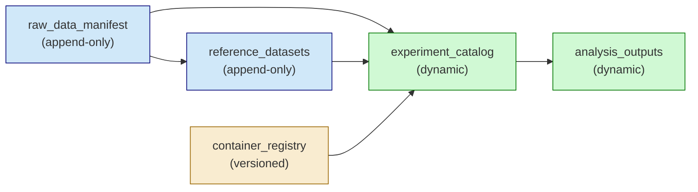
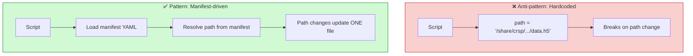

# Manifest-Driven Development

Use YAML manifests as single sources of truth for paths, configurations, and project state.

## Manifest Categories

| Manifest | Purpose | Mutability |
|----------|---------|------------|
| `raw_data_manifest.yaml` | Raw data + preprocessing outputs | Append-only |
| `reference_datasets.yaml` | External atlases, models, references | Append-only |
| `container_registry.yaml` | HPC containers and environments | Versioned |
| `experiment_catalog.yaml` | Experiment tracking | Dynamic |
| `analysis_outputs.yaml` | Contributions from experiments | Dynamic |

### Manifest Dependency Chain



## Manifest Design Patterns

### 1. Source of Truth Pattern

One authoritative location for each piece of information:

```yaml
# raw_data_manifest.yaml
# This file is the GROUND TRUTH for all data in the project.
# All other manifests must derive from this file.

preprocessing:
  base_path: "project/01_Preprocessing/outputs"

  full_cohort:
    h5ad: 17_ScviIntegration/integrated_objects/integrated_adata.h5ad
    seurat: 18_IntegrationPreview/seurat_objects/integrated_seurat.rds
```

### 2. Hierarchical Organization

Organize data hierarchically:

```yaml
patients:
  Pat1:
    patient_id: Pat1
    demographics:
      age: 72
      ethnicity: White
    positions:
      P1:
        position_id: P1
        chromium:
          sample_id: Pat1_P1
          filtered_data_path: /path/to/data.h5
```

### 3. Cross-Reference Tracking

Document which components use each resource:

```yaml
celltypist_models:
  reed:
    path: models/celltypist/model_from_reed.pkl
    used_by:
      - ihbca_annotation_20251216
      - step_04_label_transfer
```

### 4. Vocabulary Definition

Define project vocabulary at the top:

```yaml
# CRITICAL: This manifest defines the vocabulary:
#   - patient_id: Pat1, Pat2, UCI604, UCI220228
#   - position_id: P1, P2_Lower, P2_UIQ, P3_A_LIQ, etc.
#   - sample_id: {patient_id}_{position_id}
#
# DO NOT modify variable names without updating downstream code!
```

## Loading Manifests

### Python Pattern

```python
import yaml
from pathlib import Path

PROJECT_ROOT = Path(os.environ.get('PROJECT_ROOT', '/path/to/project'))
MANIFEST_PATH = PROJECT_ROOT / "project/config/reference_datasets.yaml"

with open(MANIFEST_PATH) as f:
    manifest = yaml.safe_load(f)

base_path = PROJECT_ROOT / manifest['base_path']
model_path = base_path / manifest['iHBCA']['files']['scvi_model']['path']
```

### R Pattern

```r
library(yaml)

project_root <- Sys.getenv("PROJECT_ROOT", "/path/to/project")
manifest_path <- file.path(project_root, "project/config/reference_datasets.yaml")

# Use readLines + yaml.load for container reliability
file_content <- readLines(manifest_path, warn = FALSE)
manifest <- yaml::yaml.load(paste(file_content, collapse = "\n"))

model_path <- file.path(project_root, manifest$iHBCA$files$scvi_model$path)
```

### Manifest-Driven vs Hardcoded Paths



### Container Gotcha

Inside Singularity containers, use `readLines()` + `yaml::yaml.load()` instead of `yaml::read_yaml()` for more reliable parsing.

## Experiment Catalog Pattern

Track experiments and their status:

```yaml
version: '0.1'
last_updated: '2026-01-06'
experiments:
  sample_correlation_clustering_20251217:
    location: DifferentialAbundance/sample_correlation_clustering_20251217
    status: complete
    created_date: '2025-12-17'
    last_modified: '2026-01-06'
    version: '1.0'
    tags:
      - milor
      - clustering
    dependencies:
      - preprocessing.full_cohort.milo
    description: |
      Sample-level correlation clustering using MiloR neighborhood abundances.
    key_outputs:
      - split_catalog.rds
      - da_results.csv
```

## Reference Datasets Pattern

Structure for external resources:

```yaml
iHBCA:
  description: "Reed et al. integrated Human Breast Cell Atlas"
  citation: "Reed et al. 2024, Nature Genetics"
  paper_url: https://www.nature.com/articles/s41588-024-01688-9
  base_path: "/share/crsp/lab/dalawson/share/3_Downloaded_Datasets/iHBCA_Reed_2024"

  sources:
    CELLxGENE:
      collection_url: https://cellxgene.cziscience.com/collections/...
    Zenodo:
      doi: 10.5281/zenodo.13735853

  files:
    integration_h5ad:
      path: integrated_atlas/integration_iHBCA.h5ad
      download_url: https://datasets.cellxgene.cziscience.com/...
      size_estimate: "~18GB"
      downloaded: 2024-11-19
      used_by:
        - ihbca_integration_20251216
```

## Container Registry Pattern

Define HPC environments:

```yaml
containers:
  R_spatial:
    path: /dfs7/singularity_containers/rcic/JHUB3/Rocky8_jupyter_base_R4.3.3_Spatial.sif
    r_libs_user: /data/homezvol0/user/biojhub4_dir/Rocky8_jupyter_base_R4.3.3_Spatial.sif/R/library
    packages:
      - Seurat
      - miloR
      - ggplot2

  Python_spatial:
    path: /dfs8/singularity_containers/rcic/devel/Jupyter_R_4.4.2_Giotto_Spatial_Python_2025Q2.sif
    packages:
      - scanpy
      - scvi-tools
      - celltypist

conda_environments:
  celltypist_env:
    create_command: |
      mamba create -n celltypist_env celltypist scanpy
```

## Configurability Guidelines

### Always Configurable

- Reference model/dataset paths (via manifest)
- QC thresholds (MAD multipliers, minimum counts)
- Algorithm hyperparameters you've intentionally set
- Batch correction keys
- Filtering criteria

### Rely on Library Defaults

- Values intrinsic to the method
- Library internal architecture
- When using method as designed

### Configuration Hierarchy

1. **Manifest YAML** - Resource locations
2. **experiment_metadata.yaml** - Experiment-specific parameters
3. **Script-level constants** - Only deliberate deviations
4. **Library defaults** - Trust for intrinsic values

### Configuration Precedence

```
           ┌───────────────────┐
           │  Library Defaults  │  Trust for intrinsic values
           │  (lowest priority) │
         ┌─┴───────────────────┴─┐
         │  Script-level constants│  Deliberate deviations only
       ┌─┴───────────────────────┴─┐
       │ experiment_metadata.yaml   │  Experiment-specific params
     ┌─┴───────────────────────────┴─┐
     │    Manifest YAML (top level)   │  Resource locations
     │      (highest priority)        │  Source of truth
     └───────────────────────────────┘
```

## Manifest Maintenance

### Append-Only Policy

Raw data and reference manifests should be append-only:
- Add new entries
- Mark deprecated entries
- Never delete working entries

### Version Tracking

```yaml
version: '1.2'
last_updated: '2026-01-13'
changelog:
  - version: '1.2'
    date: '2026-01-13'
    changes:
      - Added compartment Milo objects
  - version: '1.1'
    date: '2025-12-16'
    changes:
      - Initial preprocessing outputs
```

### Cross-Manifest Consistency

When adding to one manifest, update related manifests:
- `used_by` lists in reference_datasets
- `dependencies` in experiment_catalog
- `contributions` in analysis_outputs
