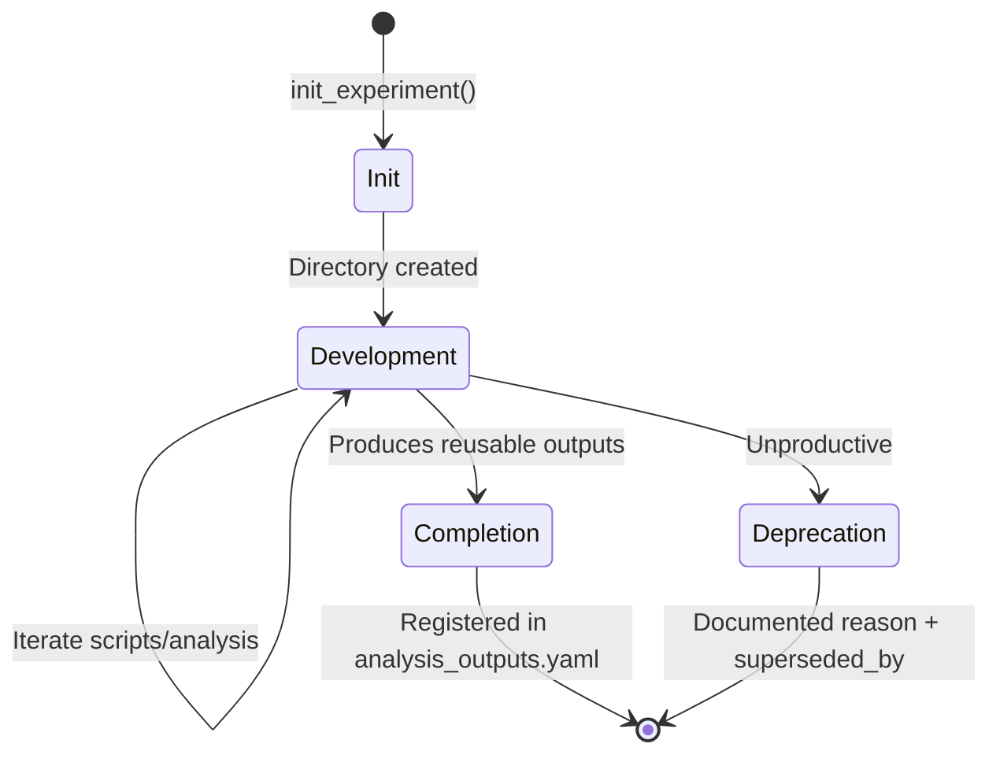
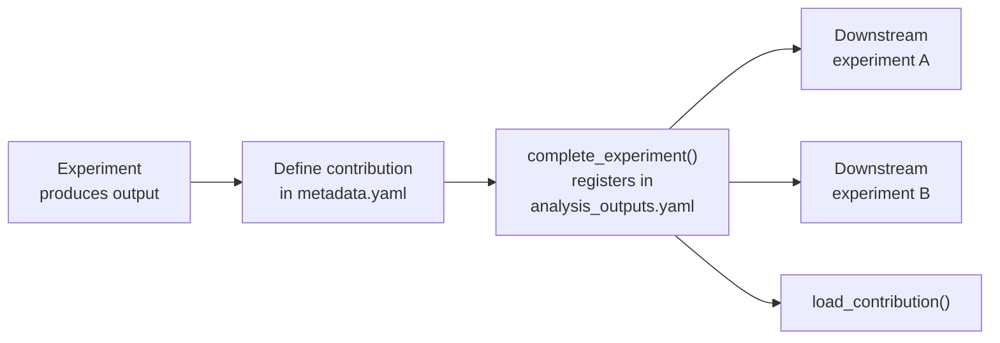

# Experiment Lifecycle Management

A systematic approach to organizing analysis experiments with version control and reproducibility.

## Design Philosophy

Each analysis is an **experiment** with:
- Defined start date (versioning)
- Clear scope and objectives
- Self-contained artifacts
- Tracked status and outputs
- Documented completion or deprecation

## Directory Structure

```
project/02_Analyses/
├── analyses/                          # Experiments by research area
│   ├── Integration/
│   │   └── ihbca_integration_20251216/
│   ├── CellAnnotation/
│   │   └── ihbca_annotation_20251216/
│   ├── DifferentialAbundance/
│   │   └── sample_clustering_20251217/
│   ├── SpatialAnalysis/
│   └── QualityControl/
├── outputs/                           # Outputs by experiment
│   └── ihbca_integration_20251216/
│       ├── intermediate/
│       └── results/
├── scripts/                           # Shared utilities
│   ├── init_experiment.R
│   ├── complete_experiment.R
│   ├── deprecate_experiment.R
│   └── utils/
└── config/
    ├── experiment_catalog.yaml
    └── analysis_outputs.yaml
```

## Experiment Structure

```
experiment_name_YYYYMMDD/
├── experiment_metadata.yaml   # Configuration and tracking
├── README.md                  # Documentation
├── scripts/                   # Analysis scripts
│   ├── 1_preprocessing.R
│   ├── 2_analysis.Rmd
│   └── utils/                 # Experiment-specific utilities
├── run/                       # SLURM job scripts
│   └── run_analysis.sh
├── reports/                   # Rendered HTML reports
├── .dev/                      # Development artifacts (gitignored)
│   ├── logs/                  # SLURM job logs
│   └── plans/                 # Session planning documents
└── dev/                       # Development workspace (gitignored)
```

**Tracking status of each path:**

```
experiment_name_YYYYMMDD/
├── experiment_metadata.yaml   # 📋 Tracked (git)
├── README.md                  # 📋 Tracked (git)
├── scripts/                   # 📋 Tracked (git)
├── run/                       # 📋 Tracked (git)
├── reports/                   # 📋 Tracked (git) - rendered HTML
├── .dev/                      # 🚫 Gitignored
│   ├── logs/                  #    SLURM job logs (ephemeral)
│   └── plans/                 #    Session plans (ephemeral)
└── dev/                       # 🚫 Gitignored - scratch workspace
```

## Lifecycle Stages



### 1. Initialization

```r
source("project/02_Analyses/scripts/init_experiment.R")
init_experiment("sample_clustering", "DifferentialAbundance",
                description = "Cluster samples by composition profiles")
```

Creates:
- Directory structure
- `experiment_metadata.yaml` with initial config
- README template
- Starter Rmd notebook

### 2. Development

During active development:
- Scripts in `scripts/`
- SLURM scripts in `run/`
- Logs in `.dev/logs/`
- Session plans in `.dev/plans/`

Key principles:
- Write intermediate outputs to `outputs/{experiment}/intermediate/`
- Write final outputs to `outputs/{experiment}/results/`
- Document decisions in README
- Update `experiment_metadata.yaml` with key outputs

### 3. Completion

When experiment produces reusable outputs:

```r
source("project/02_Analyses/scripts/complete_experiment.R")
complete_experiment("sample_clustering_20251217")
```

This:
- Validates contribution files exist
- Updates status to "complete"
- Registers contributions to `analysis_outputs.yaml`

### 4. Deprecation

If experiment is unproductive:

```r
source("project/02_Analyses/scripts/deprecate_experiment.R")
deprecate_experiment("old_approach_20251210",
                     reason = "Superseded by better method",
                     superseded_by = "new_approach_20251215")
```

## Experiment Metadata

### experiment_metadata.yaml

```yaml
experiment_name: sample_clustering_20251217
original_name: sample_clustering
research_area: DifferentialAbundance
created_date: '2025-12-17'
status: development  # development | complete | deprecated
version: '0.1'

description: |
  Cluster samples by MiloR neighborhood composition profiles.

tags:
  - milor
  - clustering
  - composition

output_paths:
  intermediate: outputs/sample_clustering_20251217/intermediate
  results: outputs/sample_clustering_20251217/results

key_outputs:
  - clustering_results.rds
  - da_results.csv

dependencies:
  - preprocessing.full_cohort.milo

# If producing reusable outputs
contributions:
  - name: sample_clusters
    type: sample_annotations
    file: clustering_results.csv
    columns: [sample_id, cluster]
    join_key: sample_id
    scope: full_cohort
    description: "Sample cluster assignments based on composition"
```

## Session Plans

Preserve session plans for context:

```bash
# After each Claude session working on experiment
cp ~/.claude/plans/current_plan.md \
   experiment_name/.dev/plans/topic_YYYYMMDD.md
```

Plans capture:
- Design decisions and rationale
- Implementation details
- Known limitations
- Deferred work

## Research Areas

Organize experiments by research focus:

| Area | Purpose |
|------|---------|
| Integration | Combining datasets, batch correction |
| CellAnnotation | Cell type labeling, validation |
| DifferentialAbundance | Composition changes across conditions |
| SpatialAnalysis | Tissue architecture, spatial patterns |
| QualityControl | Data validation, filtering |

## Contribution System



### Defining Contributions

When an experiment produces reusable outputs:

```yaml
contributions:
  - name: cluster_annotations
    type: cell_annotations
    file: cluster_labels.csv
    columns: [cell_id, cluster_annotation]
    join_key: cell_id
    scope: full_cohort
    description: "Manual cluster annotations at resolution 0.5"
```

### Contribution Types

| Type | Description |
|------|-------------|
| cell_annotations | Labels for individual cells |
| sample_annotations | Labels for samples |
| cluster_annotations | Labels for clusters |
| gene_signatures | Gene sets |
| embeddings | Dimensionality reduction results |

### Loading Contributions

```r
source("project/02_Analyses/scripts/utils/load_contributions.R")
cluster_labels <- load_contribution("cluster_annotations",
                                    from = "ihbca_annotation_20251216")
```

## HPC Considerations

### SLURM Logs Location

Logs go in experiment's `.dev/logs/`:

```bash
#SBATCH --output=/path/to/experiment/.dev/logs/job_%j.out
#SBATCH --error=/path/to/experiment/.dev/logs/job_%j.err
```

### Rendered Reports

Simple deployments: `reports/` in experiment
Scaled deployments: `outputs/{experiment}/reports/`

## Best Practices

### 1. One Experiment, One Question

Each experiment addresses a specific research question. If scope expands significantly, consider a new experiment.

### 2. Date-Based Naming

The `_YYYYMMDD` suffix:
- Provides automatic versioning
- Allows multiple iterations
- Shows chronological order

### 3. Document as You Go

Update README with:
- Objectives and approach
- Key findings
- Limitations discovered
- Next steps identified

### 4. Clean Completion

Don't leave experiments in "development" indefinitely:
- Complete if producing value
- Deprecate if unproductive
- Document either way

### 5. Preserve Context

Session plans capture the "why" that code doesn't show. Preserve them in `.dev/plans/` for future reference.
