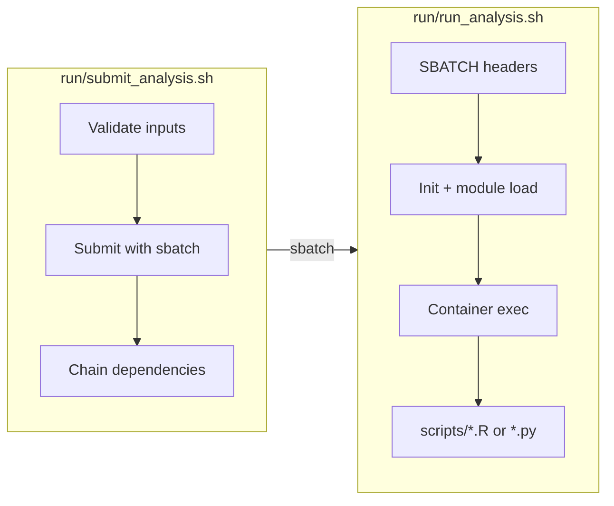
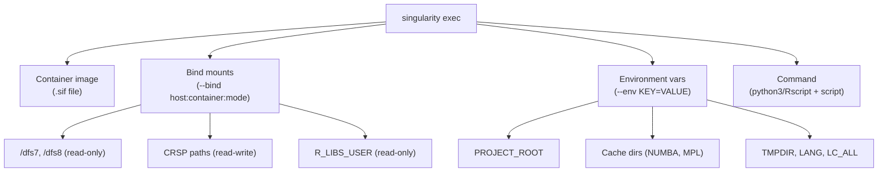
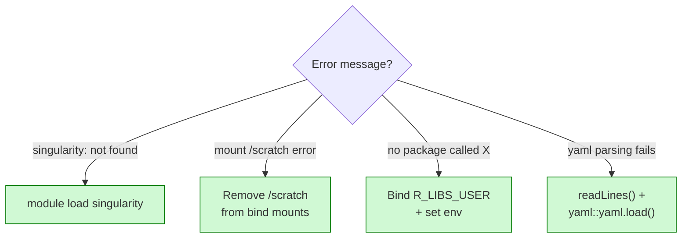

# HPC Infrastructure Patterns

Patterns for SLURM job scripts and Singularity containers, with hard-won debugging lessons.

## Two-Script Pattern

Separate job submission from execution:

```
run/
├── submit_analysis.sh    # Validates, submits, handles dependencies
└── run_analysis.sh       # SBATCH directives, container execution
```



## Worker Script Structure (run_*.sh)

### Header

```bash
#!/bin/bash
#SBATCH --job-name=experiment_step1
#SBATCH --partition=standard
#SBATCH --account=lab_account
#SBATCH --nodes=1
#SBATCH --ntasks=1
#SBATCH --mem=64G
#SBATCH --cpus-per-task=8
#SBATCH --time=02:00:00
#SBATCH --output=/full/path/to/experiment/.dev/logs/step1_%j.out
#SBATCH --error=/full/path/to/experiment/.dev/logs/step1_%j.err

set -euo pipefail
```

### Initialization

```bash
PROJECT_ROOT="/full/path/to/project"
cd "$PROJECT_ROOT"
module load singularity/3.11.3
```

### Banner Output

```bash
echo "============================================================================"
echo "Analysis Step 1: Description"
echo "============================================================================"
echo "Job ID:           ${SLURM_JOB_ID}"
echo "Node:             ${SLURMD_NODENAME}"
echo "Memory:           ${SLURM_MEM_PER_NODE:-N/A}"
echo "Project Root:     $PROJECT_ROOT"
echo "============================================================================"
```

### Validation Chain

```bash
SCRIPT="$PROJECT_ROOT/path/to/script.py"
CONTAINER="/path/to/container.sif"

if [ ! -f "$SCRIPT" ]; then
    echo "ERROR: Script not found: $SCRIPT"
    exit 1
fi

if [ ! -f "$CONTAINER" ]; then
    echo "ERROR: Container not found: $CONTAINER"
    exit 1
fi
```

## Container Execution

Every container invocation follows this structure:



### Python Container

```bash
singularity exec \
  --pwd "$PROJECT_ROOT" \
  --bind /dfs7:/dfs7:ro \
  --bind /dfs8:/dfs8:ro \
  --bind /share/crsp/lab/labname:/share/crsp/lab/labname:rw \
  --env "PROJECT_ROOT=$PROJECT_ROOT" \
  --env "NUMBA_CACHE_DIR=/tmp/numba_cache" \
  --env "MPLCONFIGDIR=/tmp/matplotlib_config" \
  "$CONTAINER" python3 "$SCRIPT" || {
    EXIT_CODE=$?
    echo "ERROR: Script failed with exit code $EXIT_CODE"
    exit $EXIT_CODE
}
```

**CRITICAL**: Always include `NUMBA_CACHE_DIR` and `MPLCONFIGDIR` - container paths like `/opt/apps/python/` are read-only.

### R Container with Rmd Rendering

```bash
# Container and R library configuration
CONTAINER="/dfs7/singularity_containers/rcic/JHUB3/Rocky8_jupyter_base_R4.3.3_Spatial.sif"
R_LIBS_USER="/data/homezvol0/user/R_libs/Rocky8_jupyter_base_R4.3.3_Spatial.sif/R/library"

# Setup temp directory (CRITICAL for pandoc/Rmd)
PIPELINE_TEMP_ROOT="$PROJECT_ROOT/.pipeline_temp"
mkdir -p "$PIPELINE_TEMP_ROOT"
JOB_TEMP_DIR=$(mktemp -d "$PIPELINE_TEMP_ROOT/job_${SLURM_JOB_ID}_XXXXXX")

# Cleanup trap
trap 'echo "CLEANUP: Removing $JOB_TEMP_DIR"; rm -rf "$JOB_TEMP_DIR"' EXIT

export TMPDIR="$JOB_TEMP_DIR"
export TMP="$JOB_TEMP_DIR"
export TEMP="$JOB_TEMP_DIR"

singularity exec \
  --cleanenv --containall --pwd "$PROJECT_ROOT" \
  --bind "$R_LIBS_USER:/home/jovyan/R/library:ro" \
  --bind /data/homezvol0/user:/home/jovyan/user:rw \
  --bind "$PROJECT_ROOT:$PROJECT_ROOT:rw" \
  --bind /share/crsp/lab/labname/share:/share/crsp/lab/labname/share:ro \
  --bind "$TMPDIR:$TMPDIR:rw" \
  --env "TMPDIR=$TMPDIR" \
  --env "TMP=$TMPDIR" \
  --env "TEMP=$TMPDIR" \
  --env "HOME=/home/jovyan" \
  --env "R_LIBS_USER=/home/jovyan/R/library" \
  --env "RSTUDIO_PANDOC=/usr/lib/rstudio-server/bin/quarto/bin/tools" \
  --env "LANG=en_US.UTF-8" \
  --env "LC_ALL=en_US.UTF-8" \
  --env "PROJECT_ROOT=$PROJECT_ROOT" \
  "$CONTAINER" Rscript "$SCRIPT"
```

**CRITICAL for R containers:**
- `--cleanenv --containall` - Isolates container environment
- `R_LIBS_USER` binding - Custom R packages
- `RSTUDIO_PANDOC` - Required for Rmd rendering
- Temp directory with cleanup trap
- `LANG` and `LC_ALL` - Prevents locale warnings

### GPU Jobs

```bash
#SBATCH --partition=free-gpu
#SBATCH --gres=gpu:1

singularity exec --nv \
  --bind ... \
  "$CONTAINER" python3 "$SCRIPT"
```

## Common Gotchas



### 1. Module Loading

**Problem**: `singularity: command not found` on compute nodes

**Fix**: Always load module first:
```bash
module load singularity/3.11.3
singularity exec ...
```

### 2. /scratch Mount Failures

**Problem**: `/scratch` doesn't exist on all nodes
```
FATAL: container creation failed: mount /scratch->/scratch error
```

**Fix**: Don't bind `/scratch`. Use only:
```bash
--bind /share/crsp/lab/labname:/share/crsp/lab/labname:rw \
--bind /dfs7:/dfs7:ro \
--bind /dfs8:/dfs8:ro
```

### 3. Missing R Packages

**Problem**: `there is no package called 'miloR'`

**Fix**: Bind R_LIBS_USER and set environment:
```bash
--bind "$R_LIBS_USER:/home/jovyan/R/library:ro" \
--env "R_LIBS_USER=/home/jovyan/R/library"
```

### 4. YAML Parsing in Containers

**Problem**: `yaml::read_yaml()` fails in containers

**Fix**: Use `readLines()` + `yaml::yaml.load()`:
```r
file_content <- readLines(manifest_path, warn = FALSE)
manifest <- yaml::yaml.load(paste(file_content, collapse = "\n"))
```

### 5. CRSP Filesystem - shutil.copy2

**Problem**: `OSError: [Errno 5] Input/output error` with `shutil.copy2`

**Fix**: Use `shutil.copy()` (CRSP doesn't support xattr):
```python
# WRONG
shutil.copy2(src, dst)

# CORRECT
shutil.copy(src, dst)
```

### 6. Relative SLURM Log Paths

**Problem**: Logs go wherever sbatch is run from

**Fix**: Always use absolute paths:
```bash
# WRONG
#SBATCH --output=logs/job_%j.out

# CORRECT
#SBATCH --output=/full/path/to/experiment/.dev/logs/job_%j.out
```

### 7. R source() CLI Blocks

**Problem**: CLI blocks in sourced scripts execute unexpectedly

**Fix**: Check if script is main:
```r
.is_main_script <- function() {
  args <- commandArgs(trailingOnly = FALSE)
  script_arg <- args[grep("--file=", args)]
  if (length(script_arg) == 0) return(FALSE)
  basename(sub("--file=", "", script_arg)) == "this_script.R"
}

if (!interactive() && .is_main_script()) {
  # CLI code here
}
```

### 8. Seurat v3 → v5 Compatibility

**Problem**: `no slot of name "images"` error

**Fix**: Update old objects:
```r
srt <- readRDS("old_seurat.rds")
srt <- UpdateSeuratObject(srt)
```

## Submission Script Pattern

### Argument Parsing

```bash
print_usage() {
    echo "Usage: $0 [OPTIONS]"
    echo "  --skip-step0    Skip if already complete"
    echo "  --start-at N    Start at step N"
    echo "  -h, --help      Show help"
}

while [[ $# -gt 0 ]]; do
    case $1 in
        --skip-step0) SKIP_STEP0=true; shift ;;
        --start-at) START_AT="$2"; shift 2 ;;
        -h|--help) print_usage; exit 0 ;;
        *) echo "ERROR: Unknown option: $1"; exit 1 ;;
    esac
done
```

### Job Chaining

```bash
JOB1=$(sbatch "$RUN_STEP1" | awk '{print $NF}')
JOB2=$(sbatch --dependency=afterok:$JOB1 "$RUN_STEP2" | awk '{print $NF}')
```

### Success Readout

```bash
echo "============================================================================"
echo "Submission Complete"
echo "============================================================================"
echo "Job ID:        $JOB_ID"
echo "Log directory: $LOG_DIR"
echo ""
echo "Monitor with:"
echo "  squeue -u \$USER"
echo "  tail -f $LOG_DIR/step1_${JOB_ID}.out"
echo "============================================================================"
```

## User-Facing Job Submission

When presenting SLURM jobs to users:

```bash
# Submit
sbatch /full/path/to/run/analysis.sh

# Submit and tail output (glob waits for file to exist)
JOB=$(sbatch --parsable /full/path/to/run/analysis.sh) && \
  while [ ! -f /full/path/to/logs/*${JOB}* ]; do sleep 1; done && \
  tail -f /full/path/to/logs/*${JOB}*

# Check status
squeue -u $USER
```

## Visualization Best Practice

Never rasterize UMAP plots in reports:

```r
# CORRECT
DimPlot(obj, raster = FALSE)
FeaturePlot(obj, features = "gene", raster = FALSE)

# WRONG - rasterized by default for large datasets
DimPlot(obj)
```

---

## HPC Safety Guidelines

See [10_HPC_PLUGIN.md](10_HPC_PLUGIN.md) for the full toolkit documentation. Key safety principles:

### Severity Levels for Operations

| Level | Examples | Action |
|-------|----------|--------|
| **LOW** | Quick test job, status checks | Proceed with brief summary |
| **MEDIUM** | Long-running job, overwriting cached results | Show impact, get confirmation |
| **HIGH** | Cancelling running job, deleting processed outputs | Explicit warning, require confirmation |
| **CRITICAL** | `rm -rf` on data, `scancel --user` | Provide command only, user executes |

### Before Job Submission

1. **Verify the script exists and is readable**
2. **Confirm resource requests are reasonable** - flag unusually large requests (>24h, >100GB, >32 cores)
3. **Validate input files exist** - check that data paths resolve
4. **Check for obvious errors** - missing shebang, hardcoded paths, missing module loads
5. **Verify output directories exist**

### Before Job Cancellation

1. **Show job details first** - use `squeue -j <jobid>`
2. **Confirm ownership** - never cancel jobs belonging to other users
3. **Check job state**:
   - PENDING: Safe to cancel
   - RUNNING: Work will be lost - confirm with user
   - COMPLETING: May corrupt output - warn strongly

### Pipeline Correctness Principle

**Deterministic, linear pipelines must produce correct results on first execution.**

- No downstream patches to fix incorrect outputs
- Verify logic before submitting HPC jobs
- Trace through code paths to confirm expected behavior
- If outputs are wrong, fix the source and re-run - never post-process

Every output must be traceable and explainable. If mapping is incomplete (e.g., 84.3% match), **understand the 15.7% before proceeding**.

---

## External References

| Topic | URL |
|-------|-----|
| HPC3 Getting Started | https://rcic.uci.edu/hpc3/getting-started.html |
| SLURM Reference | https://rcic.uci.edu/slurm/ |
| Storage (CRSP) | https://rcic.uci.edu/storage/crsp.html |
| Containers/Singularity | https://rcic.uci.edu/singularity/ |
| Software Modules | https://rcic.uci.edu/software/ |
| Account Request | https://rcic.uci.edu/account.html |
