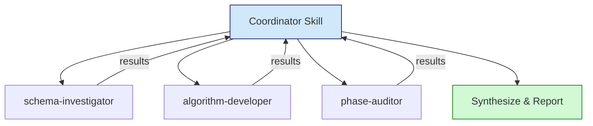
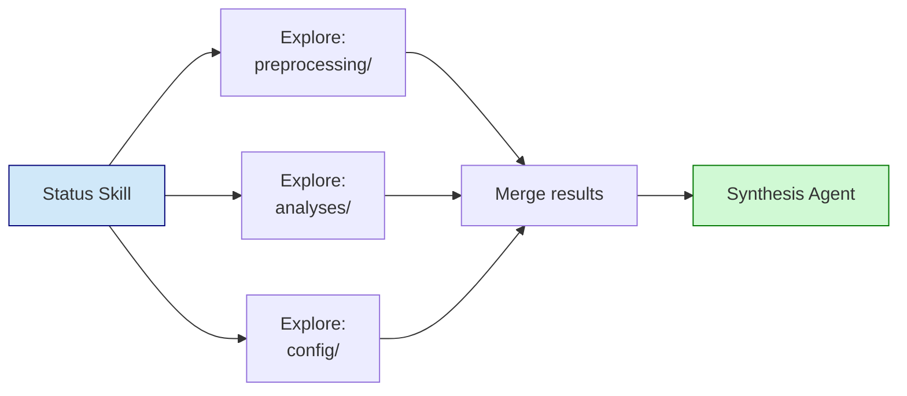

# Custom Skills and Agents

Extend Claude Code's capabilities with project-specific skills and specialized agents.

## Skills vs Agents

| Aspect | Skills | Agents |
|--------|--------|--------|
| **Organization** | Directory + SKILL.md | Single .md file |
| **Invocation** | Slash command or explicit | Task tool deployment |
| **Lifecycle** | Pre-loaded, persistent | Deployed when needed |
| **State** | Maintains conversation flow | No persistent state |
| **Use case** | Reusable workflows | Specialized implementations |

## Skill Structure

```
.claude/skills/
└── project-discovery/
    ├── SKILL.md              # Skill instructions
    ├── references/           # Supporting documentation
    │   └── patterns.md
    └── templates/            # Templates skill uses
        └── report.yaml
```

### SKILL.md Format

```markdown
---
name: project-discovery
description: Understand project structure and provide context.
---

# Project Discovery

This skill enables understanding of project structure before development.

## When to Use This Skill

**Invoke this skill when:**
- Starting work on new or unfamiliar project
- Project structure unclear
- Need to understand how task fits overall project

## Process

### Step 1: Look for Explicit Structure

Check for PROJECT_STRUCTURE.yaml:
```bash
find . -maxdepth 3 -name "PROJECT_STRUCTURE.yaml"
```

### Step 2: Detect Implicit Patterns

[Detailed process steps...]

## Output Format

Produces PROJECT_DISCOVERY.yaml with:
- Structure type (linear/branching/hybrid)
- Directory organization
- Reference implementations
```

## Example Skills

### Project Discovery

Understands project structure before development:
- Detects linear vs branching pipelines
- Identifies reference implementations
- Creates PROJECT_STRUCTURE.yaml

### Project Status

Checks project health and progress:
- Pipeline completion status
- Manifest consistency
- Git status
- Development artifacts

### HPC Monitor

Minimal SLURM job monitoring:
- Adaptive check intervals
- Status + last log line
- Post-completion summary

## Agent Structure

Agents live in `.claude/agents/`:

```
.claude/agents/
├── deprecation-handler.md
├── schema-investigator.md
└── phase-auditor.md
```

### Agent File Format

```markdown
---
name: deprecation-handler
description: Handle deprecation following project policy.
tools: Read, Glob, Grep, Bash, Write, Edit
model: sonnet
---

You are a specialized agent for handling deprecation tasks.

## Required Reading

Before any deprecation, read: `.claude/rules/analyses/deprecation-policy.md`

## Your Responsibilities

1. Create `.deprecated/` directory if needed
2. Create `DEPRECATED.md` with documentation
3. Move files preserving structure
4. Verify completion
5. Report summary

## Process

1. Read the deprecation policy
2. Identify files to deprecate
3. Create DEPRECATED.md BEFORE moving
4. Move files using `mv` commands
5. Verify and report

## Important

- Never delete - always move to .deprecated/
- Always create DEPRECATED.md
- Include de-deprecation instructions
```

## Registering Skills

### In CLAUDE.md

```markdown
## Skills

This project has custom skills - use `Skill` tool to invoke:
- `project-status` - Check project health
- `project-discovery` - Understand project structure
```

### In settings.local.json

```json
"permissions": {
  "allow": [
    "Skill(project-status)",
    "Skill(project-discovery)"
  ]
}
```

## Designing Skills

### When to Create a Skill

1. **Reusable across projects** - Generic workflow
2. **User-callable** - Direct invocation needed
3. **Stateful context** - Maintains conversation flow
4. **Orchestration role** - Coordinates other work

### Skill Design Principles

1. **Clear trigger conditions** - When to invoke
2. **Defined process** - Step-by-step workflow
3. **Structured output** - YAML or clear format
4. **Integration points** - How it connects to agents

## Designing Agents

### When to Create an Agent

1. **Phase-specific task** - Single phase work
2. **Specialized knowledge** - Deep expertise needed
3. **Isolated concern** - Focused deliverable
4. **Parallel execution** - Can run alongside others

### Agent Design Principles

1. **Clear role** - One primary responsibility
2. **Defined inputs** - What context needed
3. **Structured output** - Schema or format
4. **Tool specification** - Which tools available

## Multi-Agent Patterns

### Orchestrator-Workers

Central skill coordinates specialized agents:



```
Coordinator Skill
├── Deploy schema-investigator
├── Await results
├── Deploy algorithm-developer
├── Await results
└── Deploy phase-auditor
```

### Parallel Exploration

Multiple agents explore different areas:



```
Project Status Skill
├── Deploy Explore agent (preprocessing/)
├── Deploy Explore agent (analyses/)
├── Deploy Explore agent (config/)
├── Await all results
└── Deploy Synthesis agent
```

## Best Practices

### 1. Detailed Task Descriptions

Every agent deployment includes:
- Clear objective
- Output format
- Tool guidance
- Task boundaries

### 2. Schema-Driven Outputs

```yaml
# skill_output.schema.yaml
discovery_report:
  structure_type: string
  confidence: number
  evidence: array
```

### 3. Evidence-Based Findings

Include commands run and outputs observed:

```markdown
## Evidence

**Command**: `find . -name "step_*" -type d`
**Output**: Found 24 step directories

**Conclusion**: Linear pipeline with step-based organization
```

### 4. Human Checkpoints

Skills should pause for approval at critical points:
- Before major changes
- After investigation, before implementation
- Before deployment

## Domain-Specific Skills

### Marker Debate (Example)

Multi-agent framework for cell type annotation:

```
.claude/skills/marker-debate/
├── SKILL.md                    # Main skill
├── DESIGN_INTENT.md            # Why designed this way
├── records/                    # Session records
├── templates/                  # Phase templates
└── references/
    ├── breast_context.md       # Domain knowledge
    ├── debate_protocol.md      # How debates work
    └── prompts/                # Agent prompts
        ├── investigator.md
        ├── interpreter.md
        ├── defender.md
        └── critic.md
```

This shows a complex skill with:
- Multiple phases
- Specialized agent prompts
- Domain references
- Session persistence

---

## Real-World Example: HPC Toolkit

The `hpc-toolkit` demonstrates a unified CLI with hooks-based workflow control.

### Toolkit Structure

```
~/.claude/hpc-toolkit/
├── bin/
│   └── hpc                     # Single CLI with subcommands
├── hooks/
│   └── gate.sh                 # PreToolUse validation hook
├── docs/
│   └── CLAUDE_GUIDE.md         # Injected on first HPC command
└── logs/
    └── audit.jsonl             # Operation audit log

~/.claude/skills/hpc/
└── SKILL.md                    # HPC skill for auto-invocation
```

### How It Works

**Permission Flow:**
```
Claude attempts HPC command
         │
         ▼
PreToolUse Hook (gate.sh)
  • First HPC command → Inject CLAUDE_GUIDE.md
  • Toolkit commands (hpc *) → Pass through
  • Read-only (squeue, sacct) → Pass through
  • Raw sbatch/python/etc → BLOCK, suggest toolkit
         │
         ▼
Command executes (if approved)
         │
         ▼
Audit logged to audit.jsonl
```

### Key Commands

```bash
# Submit a job
~/.claude/hpc-toolkit/bin/hpc submit /path/script.sh \
  --purpose "Why this job" \
  --outputs "/path/to/outputs"

# Run command on compute node
~/.claude/hpc-toolkit/bin/hpc shell \
  --cmd "python script.py" \
  --module python/3.10.2 \
  --purpose "Test" \
  --time 1:00:00

# Check status, view logs, cancel
~/.claude/hpc-toolkit/bin/hpc status
~/.claude/hpc-toolkit/bin/hpc logs <job_id>
~/.claude/hpc-toolkit/bin/hpc cancel <job_id>

# File operations
~/.claude/hpc-toolkit/bin/hpc file ls /path
~/.claude/hpc-toolkit/bin/hpc file cat /path
```

### Session Documentation Injection

On first HPC command of each session, the hook injects the CLAUDE_GUIDE.md:

```
=== HPC TOOLKIT GUIDE ===

Use ~/.claude/hpc-toolkit/bin/hpc for HPC operations.

Commands: submit, shell, status, logs, cancel, file

Allowed direct SSH (read-only): squeue, sacct, sinfo, module avail

=== END GUIDE ===
```

### Design Philosophy

The toolkit ensures Claude:
1. **Documents intent** - Every submission requires purpose and outputs
2. **Uses compute nodes** - Shell commands run via srun, not login node
3. **Provides audit trail** - All operations logged
4. **Follows guardrails** - Blocked from raw dangerous commands

See [10_HPC_PLUGIN.md](10_HPC_PLUGIN.md) for complete toolkit documentation.
