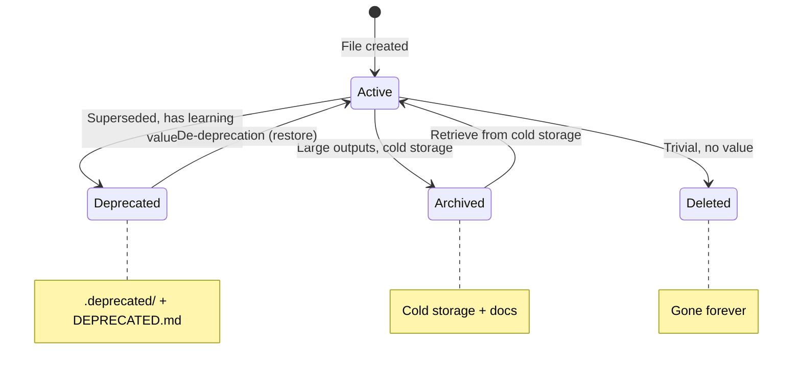

# Deprecation Policy

Preserve context when retiring code by moving to `.deprecated/` directories with documentation.

## Philosophy

**Deprecate, don't delete.** Future you (or colleagues) may need to:
- Understand why an approach was abandoned
- Recover code that turns out to be useful
- Learn from past attempts

## Directory Structure

```
experiment_name/
├── scripts/
│   └── .deprecated/
│       ├── DEPRECATED.md          # Required documentation
│       ├── old_script_1.R
│       └── old_script_2.Rmd
└── outputs/
    └── .deprecated/
        ├── DEPRECATED.md          # Required documentation
        └── old_outputs/
```

## Required Documentation

Every `.deprecated/` directory MUST contain a `DEPRECATED.md` file:

```markdown
# Deprecated Files

## Summary
[What these files did and why they existed]

## Deprecation Date
YYYY-MM-DD

## Reason
[Why this approach was abandoned - link to plan if available]

## Files Included
- `file1.R` - [brief description]
- `file2.Rmd` - [brief description]

## De-deprecation Instructions
To restore these files to active use:
1. [Step-by-step instructions]
2. [Any dependencies to restore]
3. [Configuration changes needed]

## Related
- Superseded by: [new approach/files]
- Plan reference: [link to plan if applicable]
```

## Process

### 1. Create Directory

```bash
mkdir -p experiment_name/scripts/.deprecated
```

### 2. Write Documentation FIRST

Create `DEPRECATED.md` before moving files - this ensures documentation happens.

### 3. Move Files

```bash
mv old_script.R scripts/.deprecated/
```

### 4. Verify

Check files moved correctly and documentation is complete.

## When to Deprecate



### Deprecate When:

- Approach superseded by better method
- Code no longer needed but has learning value
- Outputs replaced but may need reference
- Significant work that shouldn't be lost

### Delete Instead When:

- Code was never functional
- Outputs easily regenerated
- No learning value
- Trivial changes

### Archive Instead When:

- Very large outputs
- Cold storage appropriate
- Regeneration expensive

## Using the Deprecation Agent

The `deprecation-handler` agent automates the process:

```markdown
---
name: deprecation-handler
tools: Read, Glob, Grep, Bash, Write, Edit
---

Agent handles:
1. Creating .deprecated/ directory
2. Creating DEPRECATED.md
3. Moving files
4. Verification
5. Summary report
```

## Outputs Deprecation

For intermediate outputs that may be large:

### Consider:

- Can they be regenerated from scripts?
- How expensive is regeneration?
- Is the space needed?

### If Keeping:

```markdown
## De-deprecation Instructions

To regenerate these outputs:
1. Run: sbatch run/run_analysis.sh
2. Outputs appear in: outputs/results/
3. Estimated time: 2 hours
```

### If Archiving:

Move to cold storage instead of `.deprecated/`:

```bash
mv large_outputs/ /archive/project/deprecated/
```

Document location in DEPRECATED.md.

## Trigger Integration

Add deprecation to rules system:

```yaml
# .claude/rules/analyses/deprecation-policy.md
---
paths:
  - "**/.deprecated/**"
triggers:
  - deprecate
  - archive old
---
```

## Quick Reference Trigger

Use `DEPRECATE` trigger in conversations to invoke policy:

```
User: Let's DEPRECATE the old clustering approach

Claude: Following deprecation policy...
1. Creating .deprecated/ directory
2. Documenting in DEPRECATED.md
3. Moving files
```

## Best Practices

### 1. Document Before Moving

Write DEPRECATED.md first - it's easy to skip documentation after files are moved.

### 2. Include Context

Link to plans, discussions, or commits that explain the decision.

### 3. Be Specific About Restoration

Don't just say "move files back" - include:
- Which files
- Which locations
- What dependencies
- What configuration changes

### 4. Date Everything

Always include deprecation date for context.

### 5. Track Supersession

If something new replaces this, document what:

```markdown
## Related
- Superseded by: new_approach_20251215/
- PR: #123
- Reason: Better performance, cleaner implementation
```

## Git Considerations

### .gitignore Patterns

Don't ignore `.deprecated/` - the documentation is valuable.

### Commit Message

```
deprecate: Move old clustering approach to .deprecated/

Superseded by correlation-based clustering in
sample_correlation_clustering_20251217.

See scripts/.deprecated/DEPRECATED.md for details.
```

## Example: Full Deprecation

### Before

```
experiment/
└── scripts/
    ├── 1_preprocessing.R
    ├── 2_old_analysis.R      # To deprecate
    ├── 3_old_visualization.R # To deprecate
    └── 4_export.R
```

### After

```
experiment/
└── scripts/
    ├── 1_preprocessing.R
    ├── .deprecated/
    │   ├── DEPRECATED.md
    │   ├── 2_old_analysis.R
    │   └── 3_old_visualization.R
    ├── 2_new_analysis.R      # Replacement
    └── 3_export.R            # Renumbered
```

### DEPRECATED.md Content

```markdown
# Deprecated Files

## Summary
Original analysis approach using hierarchical clustering.
Replaced with correlation-based clustering for better
separation of biological groups.

## Deprecation Date
2025-12-17

## Reason
Hierarchical clustering produced arbitrary groupings that
didn't correspond to known biological categories. Correlation-
based approach validated against known sample characteristics.

See: .dev/plans/clustering_comparison_20251215.md

## Files Included
- `2_old_analysis.R` - Hierarchical clustering implementation
- `3_old_visualization.R` - Dendrogram visualizations

## De-deprecation Instructions
To restore hierarchical clustering:
1. Move files back to scripts/
2. Update numbering (2_new_analysis.R → 2b_correlation.R)
3. No configuration changes needed

## Related
- Superseded by: 2_new_analysis.R (correlation clustering)
- Plan: .dev/plans/clustering_comparison_20251215.md
```
