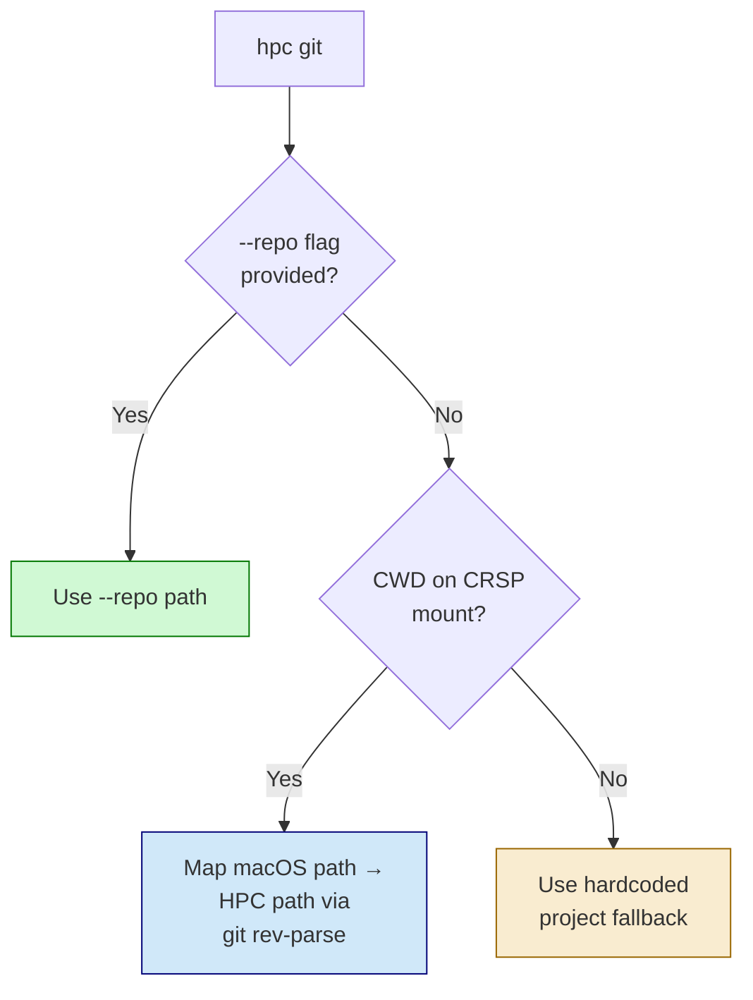
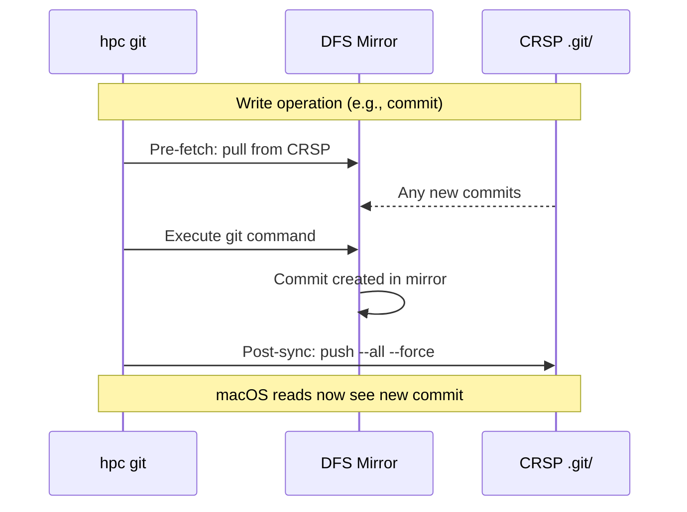

# HPC Toolkit: Unified CLI for HPC Operations

The `hpc-toolkit` provides a single CLI for all HPC operations with safety guardrails and documentation injection.

## Overview

This toolkit:
- **Provides unified interface** via `~/.claude/hpc-toolkit/bin/hpc` with subcommands
- **Blocks raw SSH commands** and redirects to the toolkit
- **Injects documentation** on first HPC command each session
- **Audits all operations** to a local log file

## Architecture

```
┌─────────────────────────────────────────────────────────────┐
│                  Claude attempts HPC command                 │
└─────────────────────────────────────────────────────────────┘
                              │
                              ▼
┌─────────────────────────────────────────────────────────────┐
│                PreToolUse Hook (gate.sh)                     │
│                                                              │
│  • First HPC command → Inject CLAUDE_GUIDE.md               │
│  • Toolkit commands (hpc *) → Pass through                  │
│  • Read-only (squeue, sacct, sinfo) → Pass through          │
│  • Raw sbatch/python/etc → BLOCK, suggest toolkit command   │
└─────────────────────────────────────────────────────────────┘
                              │
                              ▼
┌─────────────────────────────────────────────────────────────┐
│                    hpc CLI subcommands                       │
│                                                              │
│  submit   Submit a batch job with purpose/outputs           │
│  shell    Run command on compute node (with module support) │
│  status   Check job status (squeue/sacct)                   │
│  logs     View job stdout/stderr                            │
│  cancel   Cancel a job                                      │
│  file     File operations (ls, cat, rm, cp, mv, write)      │
│  git      Git operations (login node, CRSP-safe)            │
│  workspace Manage fast git mirrors on DFS                   │
└─────────────────────────────────────────────────────────────┘
```

---

## Commands Reference

### hpc submit

Submit a batch job with required documentation.

```bash
~/.claude/hpc-toolkit/bin/hpc submit <script_path> \
  --purpose "..." \
  --outputs "..." \
  [--sbatch "..."] \
  [--dry-run]
```

| Argument | Description |
|----------|-------------|
| `<script_path>` | Path to script ON HPC (must start with /) |
| `--purpose` | Why running this job (required) |
| `--outputs` | Where outputs go (required) |
| `--sbatch` | Pass-through sbatch args (--array, --mem, etc.) |
| `--dry-run` | Show what would happen without submitting |

**Example:**
```bash
~/.claude/hpc-toolkit/bin/hpc submit /share/crsp/lab/dalawson/nwechter/run/analysis.sh \
  --purpose "Process batch 1 samples" \
  --outputs "/share/crsp/lab/dalawson/nwechter/results/"
```

### hpc shell

Run a command on a compute node (not the login node).

```bash
~/.claude/hpc-toolkit/bin/hpc shell \
  --cmd "..." \
  --purpose "..." \
  --time HH:MM:SS \
  [--mem SIZE] \
  [--cpus N] \
  [--module MOD]
```

| Argument | Description |
|----------|-------------|
| `--cmd` | Command to run (required) |
| `--purpose` | Why running this (required) |
| `--time` | Max duration (required) |
| `--mem` | Memory (default: 4G) |
| `--cpus` | CPUs (default: 1) |
| `--module` | Load module before running (can repeat) |

**Example:**
```bash
~/.claude/hpc-toolkit/bin/hpc shell \
  --cmd "python3 -c 'import pandas; print(pandas.__version__)'" \
  --module python/3.10.2 \
  --purpose "Test pandas import" \
  --time 0:05:00
```

### hpc status

Check job status.

```bash
~/.claude/hpc-toolkit/bin/hpc status              # All my jobs
~/.claude/hpc-toolkit/bin/hpc status <job_id>     # Specific job details
```

### hpc logs

View job output (stdout and stderr).

```bash
~/.claude/hpc-toolkit/bin/hpc logs <job_id>           # View both stdout and stderr
~/.claude/hpc-toolkit/bin/hpc logs <job_id> -f        # Follow stdout (tail -f)
~/.claude/hpc-toolkit/bin/hpc logs <job_id> -n N      # Last N lines (default: 50)
~/.claude/hpc-toolkit/bin/hpc logs <job_id> --out     # Only stdout
~/.claude/hpc-toolkit/bin/hpc logs <job_id> --err     # Only stderr
```

Note: `hpc logs` only works for active jobs. For completed jobs, use `hpc file cat /path/to/log`.

### hpc cancel

Cancel a job.

```bash
~/.claude/hpc-toolkit/bin/hpc cancel <job_id>
~/.claude/hpc-toolkit/bin/hpc cancel <job_id> --reason "..."
```

### hpc file

File operations on HPC filesystem.

```bash
~/.claude/hpc-toolkit/bin/hpc file ls <path>            # List directory
~/.claude/hpc-toolkit/bin/hpc file cat <path>           # View file
~/.claude/hpc-toolkit/bin/hpc file head <path> [-n N]   # First N lines
~/.claude/hpc-toolkit/bin/hpc file tail <path> [-n N]   # Last N lines
~/.claude/hpc-toolkit/bin/hpc file rm <path>            # Delete file
~/.claude/hpc-toolkit/bin/hpc file cp <src> <dst>       # Copy
~/.claude/hpc-toolkit/bin/hpc file mv <src> <dst>       # Move
~/.claude/hpc-toolkit/bin/hpc file write <path>         # Write (stdin or --content)
~/.claude/hpc-toolkit/bin/hpc file mkdir <path>         # Create directory
```

All paths must be HPC paths (starting with `/`).

### hpc git

Run git commands on the HPC login node. Required for all git **write** operations on CRSP-mounted repos — CRSP's macOS SMB mount caches `.git/objects/` aggressively, causing desync between local and HPC views.

```bash
~/.claude/hpc-toolkit/bin/hpc git <git_args...>
~/.claude/hpc-toolkit/bin/hpc git --repo /path/to/repo <git_args...>
```

| Argument | Description |
|----------|-------------|
| `<git_args>` | Any git subcommand and arguments |
| `--repo` | Override repo path (default: auto-detected from CWD or hardcoded) |

**Repo resolution order:**
1. `--repo /explicit/path` — use this path
2. macOS CWD under CRSP mount → mapped to HPC path via `git rev-parse --show-toplevel`
3. Hardcoded fallback (project-specific)



**Examples:**
```bash
~/.claude/hpc-toolkit/bin/hpc git status
~/.claude/hpc-toolkit/bin/hpc git add project/config/manifest.yaml
~/.claude/hpc-toolkit/bin/hpc git commit -m "Update manifest"
~/.claude/hpc-toolkit/bin/hpc git log --oneline -5
```

Read-only git commands (`status`, `log`, `diff`, `show`) are safe to run locally. Write commands are blocked by the PreToolUse hook and redirected to `hpc git`.

### hpc workspace

Manage fast git mirrors on DFS storage. Solves the problem of slow git I/O on CRSP by keeping a bare git mirror on `/pub/$USER/git-mirrors/` (fast DFS) while the working tree stays on CRSP.

```bash
~/.claude/hpc-toolkit/bin/hpc workspace init <crsp-repo-path>
~/.claude/hpc-toolkit/bin/hpc workspace list
~/.claude/hpc-toolkit/bin/hpc workspace sync <name>
~/.claude/hpc-toolkit/bin/hpc workspace status <name>
~/.claude/hpc-toolkit/bin/hpc workspace destroy <name>
```

| Subcommand | Description |
|------------|-------------|
| `init <path>` | Create bare mirror from CRSP repo (one-time, ~350MB repos take a few minutes) |
| `list` | Show all workspaces with sync status |
| `sync <name>` | Force-push mirror → CRSP `.git/` |
| `status <name>` | Compare HEADs, show object stats, flag divergence |
| `destroy <name>` | Remove mirror (CRSP repo unaffected) |

**How it works:**

```
macOS (CRSP mount)                     HPC3 (login node via SSH)
====================                   ================================
Working tree on CRSP:                  GIT_DIR on DFS (fast local):
  /share/crsp/.../Repo/                  /pub/$USER/git-mirrors/Repo.git/
  .git/ ← sync target                     objects/, refs/, workspace.conf

hpc git commit -m "X"  ──SSH──►  GIT_DIR=/pub/…  GIT_WORK_TREE=/share/…  git commit
                                       │ (success)
                                       ▼ auto-sync
                                 git push --all --force ──► CRSP .git/
```

After `workspace init`, `hpc git` auto-detects the workspace — no workflow change needed. Write operations trigger:
- **Pre-fetch** (before `commit`, `merge`, `rebase`, `cherry-pick`, `pull`, `revert`): pulls any commits made directly on CRSP into the mirror
- **Post-sync** (after all write ops): pushes mirror state back to CRSP so local macOS reads stay current



**DFS storage choice:** `/pub/$USER/` provides 1TB on DFS. Aggressive `gc.auto=50` and `pack.compression=9` mitigate small-file overhead. `$HOME` was avoided due to 50GB quota with snapshots that preserve deleted objects.

**Concurrency note:** Don't run `hpc git` from two Claude sessions against the same repo simultaneously — SSH and CRSP I/O will serialize, causing hangs.

**Example setup:**
```bash
# One-time init
~/.claude/hpc-toolkit/bin/hpc workspace init /share/crsp/lab/dalawson/nwechter/Spatial_HBCA

# Verify
~/.claude/hpc-toolkit/bin/hpc workspace list
~/.claude/hpc-toolkit/bin/hpc workspace status Spatial_HBCA

# From here, hpc git auto-uses the workspace
~/.claude/hpc-toolkit/bin/hpc git commit -m "Fast commit via DFS mirror"
```

---

## Permission Tiers

### Allowed Direct SSH (Read-Only)

These commands pass through without blocking:

```bash
ssh hpc3 'squeue -u $USER'
ssh hpc3 'sacct -j <id>'
ssh hpc3 'sinfo'
ssh hpc3 'scontrol show job <id>'
ssh hpc3 'module avail <name>'
```

### Blocked Commands (Redirected to Toolkit)

| Blocked Pattern | Toolkit Alternative |
|-----------------|---------------------|
| `ssh hpc3 'sbatch ...'` | `hpc submit /path/script.sh --purpose "..." --outputs "..."` |
| `ssh hpc3 'python ...'` | `hpc shell --cmd "python ..." --purpose "..." --time 1:00:00` |
| `ssh hpc3 'Rscript ...'` | `hpc shell --cmd "Rscript ..." --purpose "..." --time 1:00:00` |
| `ssh hpc3 'rm ...'` | `hpc file rm /path` |
| `ssh hpc3 'scancel ...'` | `hpc cancel <job_id>` |
| `ssh hpc3 'cd /repo && git commit ...'` | `hpc git commit -m "..."` |
| Local `git add`, `git commit`, etc. on CRSP mount | `hpc git add ...`, `hpc git commit ...` |

---

## Toolkit Structure

```
~/.claude/hpc-toolkit/
├── bin/
│   └── hpc                     # Single CLI with subcommands
├── hooks/
│   └── gate.sh                 # PreToolUse validation hook
├── docs/
│   └── CLAUDE_GUIDE.md         # Injected on first HPC command
└── logs/
    └── audit.jsonl             # Operation audit log

~/.claude/skills/hpc/
└── SKILL.md                    # HPC skill for Claude auto-invocation
```

---

## Installation

### 1. Toolkit Files

The toolkit should be at `~/.claude/hpc-toolkit/` with:
- `bin/hpc` executable
- `hooks/gate.sh` executable
- `docs/CLAUDE_GUIDE.md`

### 2. Configure SSH for HPC Access

Create `~/.ssh/config`:

```
Host hpc3
    HostName hpc3.rcic.uci.edu
    User YOUR_UCINETID
    IdentityFile ~/.ssh/id_ed25519
    ControlMaster auto
    ControlPath ~/.ssh/sockets/%r@%h-%p
    ControlPersist 24h
    ServerAliveInterval 60
```

First connection triggers DUO authentication; subsequent connections within 24h reuse the socket.

### 3. Register in Claude Code Settings

Add to `~/.claude/settings.json`:

```json
{
  "permissions": {
    "allow": [
      "Bash(~/.claude/hpc-toolkit/bin/hpc *)",
      "Bash(ssh hpc3 *)"
    ]
  },
  "hooks": {
    "PreToolUse": [{
      "matcher": "Bash",
      "hooks": [{
        "type": "command",
        "command": "~/.claude/hpc-toolkit/hooks/gate.sh",
        "timeout": 5
      }]
    }]
  }
}
```

### 4. Create HPC Skill

Create `~/.claude/skills/hpc/SKILL.md` with toolkit documentation so Claude auto-invokes it for HPC tasks.

---

## Audit Log

All operations are logged to `~/.claude/hpc-toolkit/logs/audit.jsonl`:

```json
{"ts":"2026-01-26T10:00:00Z","cmd":"submit","script":"/path/script.sh","purpose":"Process batch 1","job_id":"12345678"}
{"ts":"2026-01-26T10:05:00Z","cmd":"shell","purpose":"Debug issue","time":"1:00:00"}
{"ts":"2026-01-26T10:10:00Z","cmd":"cancel","job_id":"12345678","reason":"Wrong parameters"}
```

---

## Safety Philosophy

The toolkit ensures Claude:

1. **Documents intent** - Every submission requires purpose and expected outputs
2. **Uses compute nodes** - Shell commands run via srun, not on login node
3. **Provides audit trail** - All operations logged with timestamps
4. **Follows guardrails** - Blocked from raw dangerous commands

**If a command is blocked:** The hook provides the suggested toolkit command - follow it.

---

## Troubleshooting

### SSH connection failures

1. Check VPN is connected (if off-campus)
2. Verify SSH config: `ssh -v hpc3 hostname`
3. Check DUO authentication completed
4. Verify socket directory exists: `mkdir -p ~/.ssh/sockets`

### Hook not triggering

1. Verify hook is registered in `~/.claude/settings.json`
2. Check hook script is executable: `chmod +x ~/.claude/hpc-toolkit/hooks/gate.sh`
3. Start a new Claude session (hooks are loaded at session start)

### Module not found

Use `ssh hpc3 'module avail <name>'` to find available module versions.

---

## External References

| Topic | URL |
|-------|-----|
| Claude Code Hooks | https://docs.anthropic.com/en/docs/claude-code/hooks |
| Claude Code Settings | https://docs.anthropic.com/en/docs/claude-code/settings |
| UCI HPC3 SLURM | https://rcic.uci.edu/slurm/slurm.html |
| UCI Software Modules | https://rcic.uci.edu/software/modules.html |
| SSH ControlMaster | https://en.wikibooks.org/wiki/OpenSSH/Cookbook/Multiplexing |
