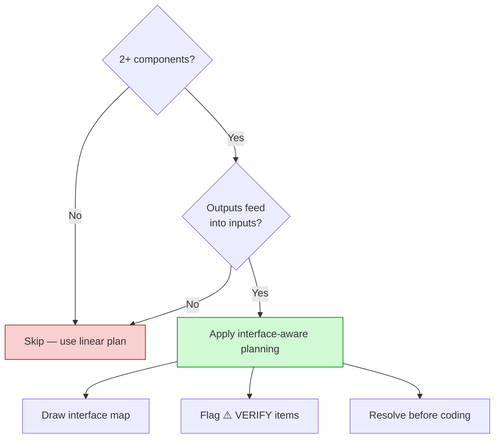
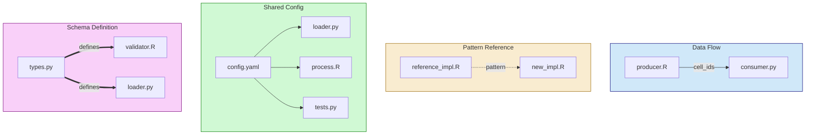

# Interface-Aware Planning

A methodology for preventing "happy path" assumptions when planning multi-component implementations.

## The Problem

Linear bullet-point plans work for simple tasks but fail for multi-component systems where:
- Outputs from one component feed inputs to another
- Multiple components share configuration
- Schemas defined in one place are expected elsewhere
- Reference implementations inform new code

**Common failure modes:**
- Assuming data formats match without verification
- Missing shared configuration dependencies
- Ignoring schema mismatches until runtime
- Building on patterns that don't exist as assumed

## When to Apply

Apply interface-aware planning for:

| Criteria | Apply? |
|----------|--------|
| 2+ components where outputs → inputs | Yes |
| Single-component implementation | No |
| Pure research/exploration | No |
| Config changes only | No |



---

## Plan Structure

### Use Graph Notation Instead of Linear Bullets

**Bad (linear):**
```
1. Read config file
2. Process data
3. Write output
4. Validate results
```

**Good (graph with interfaces):**
```
[Config Reader]
  ↓ config_dict (schema: config/types.yaml:15-30)
[Data Processor]
  ↓ processed_df (columns: id, value, category)
[Output Writer]
  ↓ output.parquet (see: outputs/schema.md)
[Validator]
```

### Reference Source Locations

Don't print full schemas inline. Point to where they're defined:

```
[Component A] → output (format defined at: src/types.py:45-60)
  ↓
[Component B] → expects input (loaded at: src/loader.py:23)
```

### Flag Uncertainties

Mark assumptions that need verification:

```
[Step 3: Build Matrix]
  Input: cell_ids from Step 2
  Output: adjacency_matrix.mtx

  ⚠️ VERIFY: Does Step 2 output include barcode suffix (-1)?
  ⚠️ VERIFY: Matrix format matches downstream MiloR expectation?
```

---

## Interface Pointer Categories

When exploring codebases for planning, categorize interface-relevant locations:



### Data Flow
Direct output → input dependency between components:

```
producer.R:45-67      →    consumer.py:23-35
(writes cell_ids)          (expects cell_ids)
```

### Pattern Reference
Logic to follow (not data exchange):

```
reference_impl.R:100-150   (pattern source for our new implementation)
```

### Shared Config
Multiple components read same configuration source:

```
config/settings.yaml:10-25
  ├── read by: src/loader.py:12
  ├── read by: scripts/process.R:45
  └── read by: tests/fixtures.py:8
```

### Schema Definition
Structure defined once, expected elsewhere:

```
types.py:30-50     (defines CellMetadata schema)
  ↓
validator.R:15     (expects matching structure)
loader.py:42       (assumes these fields exist)
```

---

## Implementation Workflow

### Phase 1: Explore for Interfaces

When launching Explore or Plan agents for multi-component work, request categorized interface pointers:

> "Include interface-relevant locations categorized by relationship type: Data Flow, Pattern Reference, Shared Config, or Schema Definition."

### Phase 2: Build Interface Map

Create a compact map showing:
1. Each component/step
2. What it produces (with schema pointer)
3. What it consumes (with source pointer)
4. Any uncertainties (⚠️ VERIFY)

### Phase 3: Verify Before Implementation

Before writing code, resolve all ⚠️ VERIFY items:
- Read the actual file locations
- Confirm formats match
- Test with sample data if needed

---

## Example: Multi-Step Pipeline Plan

```
=== INTERFACE MAP ===

[Step 1: Extract Counts]
  Input: adata.h5ad (format: AnnData with X matrix)
  Output: counts.mtx, barcodes.tsv, genes.tsv
  Source: scripts/1_extract.py:45-80

  ⚠️ VERIFY: Does adata.obs index match barcode format in Step 2?

      ↓ (counts.mtx, barcodes.tsv)

[Step 2: Build Milo Object]
  Input: counts.mtx, barcodes.tsv (expects 16-char barcodes, no -1 suffix)
  Output: milo.rds (SingleCellExperiment with graph)
  Pattern: reference at hbca_analysis/scripts/build_milo.R:50-120

  ⚠️ VERIFY: Reference pattern uses Seurat conversion?

      ↓ (milo.rds)

[Step 3: Run DA Analysis]
  Input: milo.rds (requires: nhoods computed, design columns in colData)
  Output: da_results.rds
  Config: config/da_config.yaml:design_formula

  ⚠️ VERIFY: Config design_formula columns exist in milo colData?

=== SHARED CONFIG ===

config/studies.yaml:1-50
  ├── Step 1: reads study_paths
  ├── Step 2: reads barcode_format
  └── Step 3: reads design_columns

=== SCHEMA DEFINITIONS ===

config/types.yaml:
  - CellMetadata (lines 15-30): id, study, condition, batch
  - DesignMatrix (lines 35-45): formula, covariates

=== VERIFICATIONS NEEDED ===

1. [ ] Barcode format: Does Step 1 output include -1 suffix?
2. [ ] Reference pattern: Confirm Seurat conversion approach
3. [ ] Design columns: Verify da_config.yaml columns exist in data
```

---

## Anti-Patterns

### 1. Assuming Compatibility

**Bad:**
```
Step 2 will read the output from Step 1.
```

**Good:**
```
Step 2 reads counts.mtx (expects Matrix Market format).
Step 1 writes counts.mtx using scipy.io.mmwrite().
⚠️ VERIFY: scipy uses same format as R's readMM()?
```

### 2. Ignoring Schema Mismatches

**Bad:**
```
Pass the cell metadata to the analysis function.
```

**Good:**
```
Pass cell_metadata (columns: cell_id, condition, batch)
Analysis expects: (columns: cell_id, sample, batch)
⚠️ MISMATCH: 'condition' vs 'sample' - need mapping
```

### 3. Skipping Reference Patterns

**Bad:**
```
Implement DA analysis using MiloR.
```

**Good:**
```
Implement DA analysis following pattern at:
  hbca_analysis/scripts/run_da.R:120-180
Key elements to preserve:
  - Graph construction parameters (k=30)
  - Neighborhood size (prop=0.1)
  - FDR threshold (0.05)
```

---

## Integration with TRACE Framework

Interface-aware planning aligns with TRACE's explainability requirement:

> "Every output must be traceable and explainable. If mapping is incomplete (e.g., 84.3% match), understand the 15.7% before proceeding."

Apply the same principle to interfaces:
- If schemas don't match 100%, understand why before proceeding
- If a pattern reference exists, understand what it does before deviating
- If config is shared, trace all consumers before modifying

---

## Quick Reference Triggers

When planning multi-component work:

- **INTERFACE:MAP** - Draw the interface map before coding
- **INTERFACE:VERIFY** - Resolve all ⚠️ items before implementation
- **INTERFACE:TRACE** - Follow data flow through components
- **INTERFACE:SCHEMA** - Check schema compatibility at boundaries

---

## External References

| Topic | Resource |
|-------|----------|
| Data Flow Diagrams | Standard software engineering practice |
| Schema Evolution | Database migration patterns |
| API Contract Testing | Consumer-driven contract testing |

The methodology here adapts these concepts for Claude Code planning contexts, where the "components" are scripts/functions and the "contracts" are file formats and data schemas.
