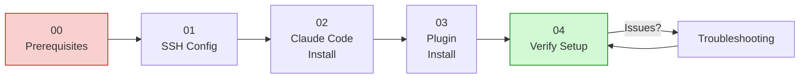
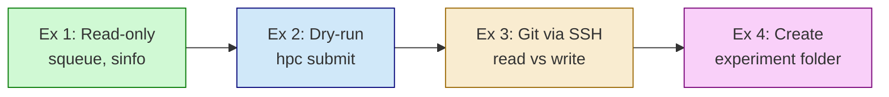

# Sandbox Learning Environment

A hands-on environment for learning Claude Code best practices with real HPC integration.

## Overview

The sandbox provides:
- **Configurable profiles** for different HPC environments (UCI HPC3, generic SLURM)
- **Step-by-step setup guides** from SSH config to first job submission
- **Global and project templates** ready to customize
- **Guided exercises** with real HPC (using --dry-run for safety)

## Philosophy

**Design principles:**
- **Default: permissive** - Easier to restrict than allow
- **Real HPC, safe mode** - Exercises use `--dry-run`, not mock systems
- **Progressive complexity** - Start with read-only, build to submissions
- **Users tighten restrictions** as they learn what needs guarding

---

## Directory Structure

```
sandbox/
├── README.md                      # Sandbox quickstart
├── config/
│   ├── sandbox.yaml               # Your settings (edit this!)
│   └── profiles/
│       ├── uci-hpc3.yaml          # UCI HPC3 defaults
│       └── generic-slurm.yaml     # Generic SLURM template
├── setup-guides/
│   ├── 00_prerequisites.md        # What you need first
│   ├── 01_ssh_config.md           # SSH setup for HPC
│   ├── 02_claude_code_install.md  # Install Claude Code
│   ├── 03_plugin_install.md       # Install hpc-toolkit plugin
│   ├── 04_verify_setup.md         # Test everything works
│   └── troubleshooting.md         # Common issues
├── global-setup/
│   ├── settings.json.template     # Global Claude settings
│   ├── hpc-toolkit/               # Production HPC CLI
│   │   ├── bin/hpc                # Unified CLI (8 subcommands)
│   │   ├── hooks/gate.sh          # PreToolUse validation hook
│   │   ├── docs/CLAUDE_GUIDE.md   # Quick reference (injected per session)
│   │   └── config.sh.template     # User configuration template
│   ├── skills/hpc/SKILL.md        # HPC skill for auto-invocation
│   └── rules/
│       ├── trace-framework.md
│       └── hpc-safety-guidelines.md
├── project-template/
│   ├── CLAUDE.md.template
│   ├── .claude/
│   │   ├── settings.local.json.template
│   │   └── rules/
│   └── project/
│       └── config/
└── exercises/
    ├── 01_first_hpc_command.md    # Read-only: squeue
    ├── 02_submit_test_job.md      # Dry-run: hpc submit
    ├── 03_git_via_ssh.md          # Git on CRSP
    └── 04_create_experiment.md    # Init experiment folder
```

---

## Quick Start

### 1. Edit Your Configuration

Open `sandbox/config/sandbox.yaml` and customize:

```yaml
profile: uci-hpc3  # or "generic-slurm"

cluster:
  ssh_alias: hpc3              # Your SSH config alias
  account: dalawson_lab        # Your SLURM account
  partition: standard
  user: your_username          # Or leave blank to auto-detect

paths:
  crsp_base: /share/crsp/lab/dalawson
  containers: /dfs7/singularity_containers

features:
  enable_hpc_plugin: true
  enable_git_hooks: true
  enable_trace_framework: true
  safety_level: permissive     # permissive, balanced, strict
```

### 2. Run Setup

```bash
cd sandbox
./setup.sh
```

The script:
- Validates your SSH config
- Installs plugin files
- Creates global rules
- Tests HPC connectivity

### 3. Complete Exercises

Work through `exercises/` in order:
1. First HPC command (read-only)
2. Submit test job (--dry-run)
3. Git via SSH
4. Create experiment folder

---

## Configuration Options

### Profiles

**uci-hpc3** (default):
```yaml
cluster:
  ssh_alias: hpc3
  hostname: hpc3.rcic.uci.edu
  account: dalawson_lab
  partition: standard
paths:
  crsp_base: /share/crsp/lab/dalawson
  containers: /dfs7/singularity_containers
```

**generic-slurm**:
```yaml
cluster:
  ssh_alias: cluster
  hostname: your.cluster.edu
  account: your_account
  partition: default
paths:
  storage_base: /path/to/storage
  containers: /path/to/containers
```

### Safety Levels

| Level | Behavior |
|-------|----------|
| `permissive` | Hooks inject docs, block raw sbatch, allow most read-only |
| `balanced` | + Prompt for git commits, job cancellation |
| `strict` | + Prompt for all writes, all HPC modifications |

Start with `permissive` and tighten as you learn.

---

## Setup Guide Overview



### 00_prerequisites.md

Before starting:
- [ ] UCI HPC3 account (request via RCIC)
- [ ] SSH key pair generated
- [ ] CRSP storage allocation
- [ ] Claude Code license/access

### 01_ssh_config.md

Create `~/.ssh/config`:
```
Host hpc3
    HostName hpc3.rcic.uci.edu
    User YOUR_UCINETID
    IdentityFile ~/.ssh/id_ed25519
    ControlMaster auto
    ControlPath ~/.ssh/sockets/%r@%h-%p
    ControlPersist 24h
    ServerAliveInterval 60

Host hpc3-headless
    HostName hpc3.rcic.uci.edu
    User YOUR_UCINETID
    IdentityFile ~/.ssh/id_ed25519
    BatchMode yes
    ControlMaster auto
    ControlPath ~/.ssh/sockets/%r@%h-%p
    ControlPersist 24h
```

**Key points:**
- First connection triggers DUO (push notification)
- Socket persists for 24h - subsequent connections skip auth
- `hpc3-headless` uses BatchMode for non-interactive scripts

### 02_claude_code_install.md

```bash
# Via npm
npm install -g @anthropic-ai/claude-code

# Or via homebrew
brew install claude-code

# Verify
claude --version
```

### 03_plugin_install.md

```bash
# Copy toolkit
mkdir -p ~/.claude/hpc-toolkit/{bin,hooks,docs,logs}
cp global-setup/hpc-toolkit/bin/hpc       ~/.claude/hpc-toolkit/bin/
cp global-setup/hpc-toolkit/hooks/gate.sh ~/.claude/hpc-toolkit/hooks/
cp global-setup/hpc-toolkit/docs/CLAUDE_GUIDE.md ~/.claude/hpc-toolkit/docs/
cp global-setup/hpc-toolkit/config.sh.template   ~/.claude/hpc-toolkit/config.sh

# Make executable
chmod +x ~/.claude/hpc-toolkit/bin/hpc
chmod +x ~/.claude/hpc-toolkit/hooks/gate.sh

# Edit config.sh for your environment, then update settings.json
```

### 04_verify_setup.md

Test each component:

```bash
# 1. SSH connection
ssh hpc3 hostname
# Expected: hpc3-xx-xx.rcic.uci.edu

# 2. HPC commands
ssh hpc3 "squeue -u $USER"
# Expected: (empty queue or your jobs)

# 3. Plugin hook (start Claude Code)
# Run: ssh hpc3 "sbatch test.sh"
# Expected: BLOCKED - redirect to hpc submit

# 4. Dry-run submission (need a script on HPC first)
~/.claude/hpc-toolkit/bin/hpc submit /path/to/test.sh \
  --purpose "Verify setup" \
  --outputs "/tmp/" \
  --dry-run
# Expected: "[DRY RUN] Would execute: ssh hpc3 sbatch ..."

# 5. Shell command test
~/.claude/hpc-toolkit/bin/hpc shell \
  --cmd "echo hello" \
  --purpose "Test shell" \
  --time 0:05:00
# Expected: "hello" from compute node
```

---

## Exercise Overview



### Exercise 1: First HPC Command

**Goal:** Run read-only SLURM commands via Claude.

**Steps:**
1. Start Claude Code in sandbox project
2. Ask: "Check my HPC job queue"
3. Observe: Hook passes through, quick reference shows on first command

**Verify:** No prompts, immediate result.

### Exercise 2: Submit Test Job

**Goal:** Understand hpc submit form-based submission.

**Steps:**
1. Ask Claude to submit a test job
2. Observe: Raw sbatch blocked, redirected to hpc submit
3. Use --dry-run to see what would happen

**Verify:** Dry-run output shows full submission details.

### Exercise 3: Git via SSH

**Goal:** Understand git permission tiers on CRSP repos.

**Steps:**
1. Ask Claude to check git status of a repo on HPC
2. Observe: Read-only git commands pass through
3. Try a commit: Observe confirmation prompt

**Verify:** Safe commands auto-approve, writes prompt.

### Exercise 4: Create Experiment

**Goal:** Initialize an experiment folder using project patterns.

**Steps:**
1. Use project-template as base
2. Ask Claude to initialize a new experiment
3. Observe: Uses experiment lifecycle patterns

**Verify:** Folder structure matches template.

---

## Using the Templates

### Global Settings Template

Copy `global-setup/settings.json.template` to `~/.claude/settings.json`:

```json
{
  "permissions": {
    "allow": [
      "Bash(~/.claude/hpc-toolkit/bin/hpc *)",
      "Bash(ssh hpc3 *)"
    ]
  },
  "hooks": {
    "SessionStart": [{
      "hooks": [{
        "type": "command",
        "command": "cat ~/.claude/rules/trace-framework.md 2>/dev/null || true"
      }]
    }],
    "PreToolUse": [{
      "matcher": "Bash",
      "hooks": [{
        "type": "command",
        "command": "~/.claude/hpc-toolkit/hooks/gate.sh",
        "timeout": 5
      }]
    }]
  }
}
```

### Project Template

Copy `project-template/` to start a new project:

```bash
cp -r sandbox/project-template ~/my-new-project
cd ~/my-new-project
mv CLAUDE.md.template CLAUDE.md
# Edit CLAUDE.md for your project
```

---

## Troubleshooting

### SSH connection refused

1. Check VPN (required off-campus)
2. Verify key: `ssh -v hpc3 hostname`
3. Check socket directory: `mkdir -p ~/.ssh/sockets`

### Plugin not loading

1. Verify path: `ls ~/.claude/hpc-toolkit/`
2. Check settings.json has correct hook path
3. Restart Claude Code

### Hook errors

1. Make scripts executable: `chmod +x ~/.claude/hpc-toolkit/hooks/*.sh`
2. Test hook directly with sample JSON input
3. Check Python 3 available for hpc-logger.py

### DUO not prompting

1. Check phone has Duo Mobile installed
2. Try: `ssh hpc3` directly first to complete auth
3. Verify ControlPersist is working: `ls ~/.ssh/sockets/`

---

## External References

### UCI HPC / RCIC Documentation

| Topic | URL |
|-------|-----|
| HPC3 Getting Started | https://rcic.uci.edu/hpc3/getting-started.html |
| SLURM Reference | https://rcic.uci.edu/slurm/ |
| Storage (CRSP) | https://rcic.uci.edu/storage/crsp.html |
| Containers/Singularity | https://rcic.uci.edu/singularity/ |
| Account Request | https://rcic.uci.edu/account.html |

### Claude Code Documentation

| Topic | URL |
|-------|-----|
| Claude Code Overview | https://docs.anthropic.com/en/docs/claude-code |
| Hooks System | https://docs.anthropic.com/en/docs/claude-code/hooks |
| Settings & Config | https://docs.anthropic.com/en/docs/claude-code/settings |
| Custom Skills | https://docs.anthropic.com/en/docs/claude-code/skills |

### SSH / Authentication

| Topic | URL |
|-------|-----|
| SSH Config Manual | https://man.openbsd.org/ssh_config |
| ControlMaster Multiplexing | https://en.wikibooks.org/wiki/OpenSSH/Cookbook/Multiplexing |
| UCI DUO Setup | https://www.oit.uci.edu/duo/ |
