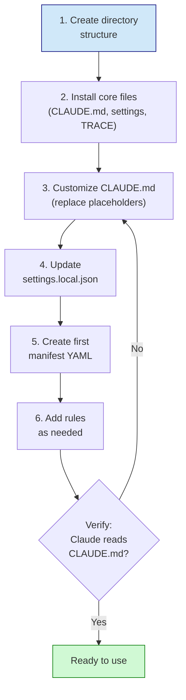

# Getting Started

This guide helps you set up these best practices for a new project. The patterns here were developed for scientific computing workflows on HPC systems.

## For Claude: What This Package Contains

When you encounter a project using these patterns, understand:

1. **CLAUDE.md** at project root is your orientation document - read it first
2. **`.claude/rules/`** contains contextual guidance activated by file paths
3. **`.claude/trace-framework.md`** defines objectivity and scope discipline expectations
4. **Manifests in `project/config/`** are the source of truth for paths - never hardcode
5. **Experiments** are date-versioned analysis units with defined lifecycles

Your behavior should reflect:
- Neutral acknowledgments over praise
- Explicit scope boundaries before implementation
- Manifest lookups for paths, not assumptions
- Deprecation over deletion when retiring code

## Setup Steps



### 1. Create Directory Structure

```bash
mkdir -p .claude/rules
mkdir -p project/config
```

### 2. Install Core Files

Copy from `templates/`:

```bash
# Project instructions (REQUIRED - customize heavily)
cp templates/CLAUDE.md ./CLAUDE.md

# Claude settings (REQUIRED - update paths)
cp templates/settings.local.json .claude/settings.local.json

# Objectivity framework (RECOMMENDED - use as-is)
cp templates/trace-framework.md .claude/trace-framework.md
```

### Global Setup: HPC Toolkit (One-Time)

The steps above set up **project-level** files. If you use HPC, you also need the **user-level** toolkit installed once on your machine:

```bash
cd /path/to/ClaudeForBioinformatics_NW/sandbox
```

Follow `setup-guides/03_plugin_install.md` to install:
- `~/.claude/hpc-toolkit/` — unified CLI and gate hook
- `~/.claude/skills/hpc/` — HPC skill
- `~/.claude/rules/` — safety guidelines and trace framework
- `~/.claude/settings.json` — hooks and permissions

This is separate from project config. Project files (CLAUDE.md, `.claude/settings.local.json`) live in each project. The toolkit lives in your home directory and works across all projects.

### 3. Customize CLAUDE.md

Replace all bracketed placeholders:

- `[Project Name]` - Your project name
- `[location]` - Directory paths
- `[Status]` - Phase status
- `[ResearchArea]` - Your domain categories
- `[/path/to/...]` - Actual HPC paths

Key sections to populate:
- Project Overview (what this project does)
- Current Phase (where work is focused)
- Quick Reference / Manifests (your config files)
- HPC Environment (your cluster specifics)

### 4. Update settings.local.json

Modify for your environment:

```json
{
  "permissions": {
    "allow": [
      // Add commands you need
    ],
    "additionalDirectories": [
      // Add reference codebases if any
    ]
  }
}
```

### 5. Create Your First Manifest

At minimum, create `project/config/raw_data_manifest.yaml`:

```yaml
# Source of truth for data paths
# All scripts load paths from here - never hardcode

base_paths:
  raw_data: "/path/to/raw/data"
  outputs: "project/outputs"

datasets:
  primary:
    path: "/path/to/main/dataset"
    description: "Primary dataset for analysis"
```

### 6. Add Rules As Needed

Create `.claude/rules/` files for domain-specific guidance:

```markdown
---
paths: project/analyses/**/*.R
---

# Analysis Scripts

[Domain-specific patterns and gotchas for your project]
```

## Minimal vs Full Setup

### Minimal (start here)

```
project/
├── CLAUDE.md
├── .claude/
│   ├── settings.local.json
│   └── trace-framework.md
└── project/
    └── config/
        └── raw_data_manifest.yaml
```

### Full (grow into this)

```
project/
├── CLAUDE.md
├── .claude/
│   ├── settings.json
│   ├── settings.local.json
│   ├── trace-framework.md
│   ├── rules/
│   │   ├── hpc-execution.md
│   │   └── analyses/
│   │       ├── experiment-lifecycle.md
│   │       └── deprecation-policy.md
│   ├── skills/
│   │   └── project-status/
│   │       └── SKILL.md
│   └── agents/
│       └── deprecation-handler.md
└── project/
    ├── config/
    │   ├── raw_data_manifest.yaml
    │   ├── reference_datasets.yaml
    │   └── container_registry.yaml
    └── 02_Analyses/
        ├── analyses/
        ├── outputs/
        ├── scripts/
        │   └── init_experiment.R
        └── config/
            └── experiment_catalog.yaml
```

## For Claude: Working With These Patterns

### When Starting a Session

1. Read CLAUDE.md for project orientation
2. Check experiment_catalog.yaml for active work
3. Note which rules apply to current task

### When Implementing

1. State scope explicitly before writing code
2. Load paths from manifests, not hardcoded
3. Use CLARIFY:FIRST for ambiguous requirements
4. Use SCOPE:EXTEND to request permission for out-of-scope changes

### When Finishing Work

1. Update experiment_metadata.yaml if relevant
2. Suggest next steps without implementing
3. If deprecating, follow deprecation policy

### Communication Style

Per trace-framework.md:
- "Understood" over "Great idea!"
- "Noted" over "Excellent point!"
- "Proceeding" over "I'd be happy to!"
- Direct corrections without apology
- Disagree when evidence supports it

## Adapting for Your Domain

### Replace Domain Vocabulary

The templates reference single-cell genomics concepts. Replace with your domain:

| Template Term | Your Domain Equivalent |
|---------------|------------------------|
| cells | [your units] |
| samples | [your samples] |
| patients | [your subjects] |
| compartments | [your categories] |
| Integration, CellAnnotation, etc. | [your research areas] |

### HPC Customization

Update for your cluster:

| Setting | Example |
|---------|---------|
| Partition | `standard`, `free-gpu`, `highmem` |
| Account | `lab_account` |
| Container paths | `/path/to/singularity/containers/` |
| Bind mounts | Your data filesystem paths |

## Verification

After setup, verify Claude can:

1. Find and read CLAUDE.md
2. Locate manifest files
3. Understand project structure
4. Apply trace-framework objectivity

Test with: "Summarize this project's structure and current status"
